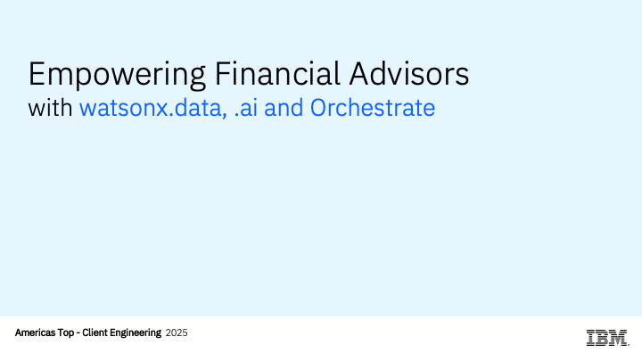
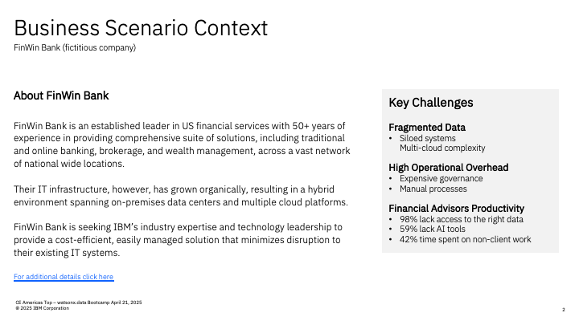
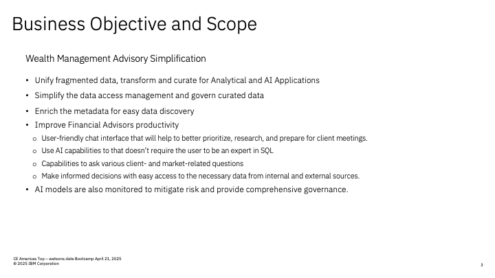
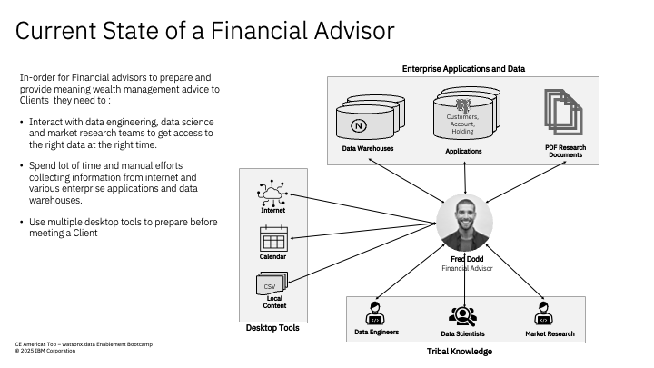
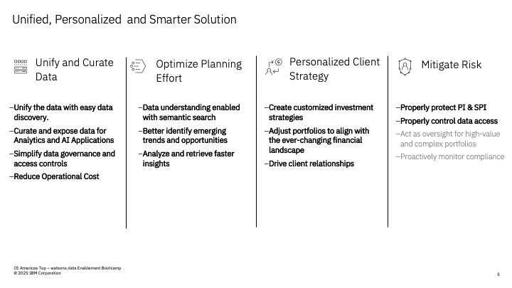

# Business Scenario

<!--  -->

FinWin Bank (fictitious company), a well-established leader in US financial services with over five decades of experience, provides a comprehensive suite of solutions, including traditional and online banking, brokerage, and wealth management, across a vast network of national wide locations. Their IT infrastructure, however, has grown organically, resulting in a hybrid environment spanning on-premises data centers and multiple cloud platforms. This has led to critical data management challenges:

Fragmented data repositories, creating silos and impeding enterprise-wide data access.
Increased operational costs and time spent on data governance and management.
Difficulty in delivering timely and accurate data to employees, hindering their ability to effectively serve clients.
FinWin Bank's market research team produces vital economic and industry analysis to support client investment strategies. However, employee feedback reveals significant data access limitations and lack of modern tools for them to be efficient :

98% of employees report insufficient access to the data required to provide wealth management guidance to the customers they support.
42% of financial advisors dedicate a substantial portion of their time to non-client-facing tasks.
59% of advisors lack access to AI-powered tools, resulting in inefficient manual processes.
To address these challenges and significantly improve financial advisor productivity and customer satisfaction, XYZ Bank is seeking IBM’s industry expertise and technology leadership to provide a cost-efficient, easily managed solution that minimizes disruption to their existing IT systems. This solution should:

Unify and leverage curated enterprise data assets, enabling employees to access the right data at the right time.
Facilitate easy data discovery, empowering employees to quickly locate relevant information.
Implement intuitive AI tools to automate repetitive tasks and enhance financial advisor efficiency.

<!--  -->

