# Web Tools Agent

**Table of contents**
- [Web Tools Agent](#web-tools-agent)
  - [1. Introduction](#1-introduction)
  - [2. Prerequisites](#2-prerequisites)
  - [3. Build the AI Agent in watsonx.ai](#3-build-the-ai-agent-in-watsonxai)
  - [4. Integrate agent into watsonx Orchestrate](#4-integrate-agent-into-watsonx-orchestrate)
    - [4.1 Create an agent in orchestrate](#41-create-an-agent-in-orchestrate)
    - [4.2 Deploy Agent](#42-deploy-agent)
    - [4.3 Test Agent](#43-test-agent)


## 1. Introduction 
In this lab, we will create a google search agent that performs real-time web searches to retrieve the most relevant results for a user's query.  We will use watsonx.ai to create the agent and then will create a wrapper agent in watsonx Orchestrate to use the external agent.

## 2. Prerequisites

- Completed  [Environment Setup](env-setup/wealth-mgr-env-setup.md) 

## 3. Build the AI Agent in watsonx.ai

1. Open watsonx.ai Studio Service - From [Cloud Resource list](https://cloud.ibm.com/resources) select `AI / Machine Learning` resources -> `watsonx.ai Studio` service -> open in `IBM watsonx`
<br>
1. Login and from the quick access page, Select `Build an AI agent to automate tasks`
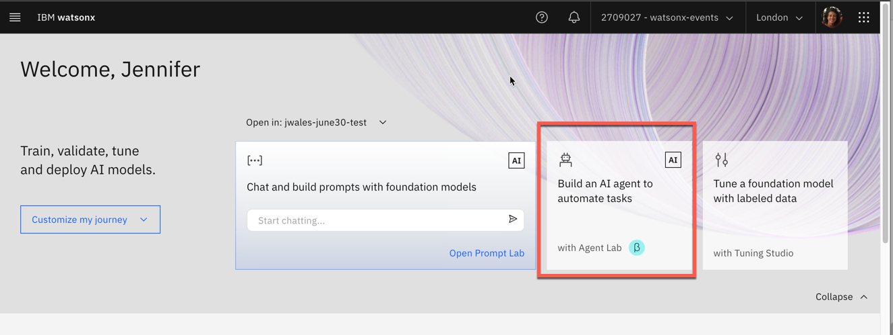
1. Expand Setup and provide Name and Description for the agent:
   * Name = `websearch-agent`
   * Description = 
    ```You are an agent that performs real-time web searches to retrieve the most relevant results for a user query.```
    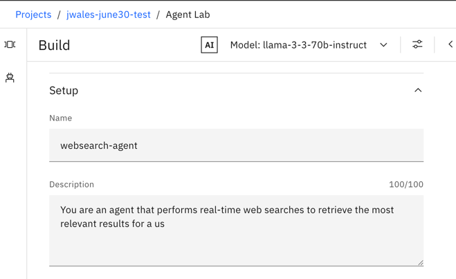
2. Under `Tools`, select `Add a tool`
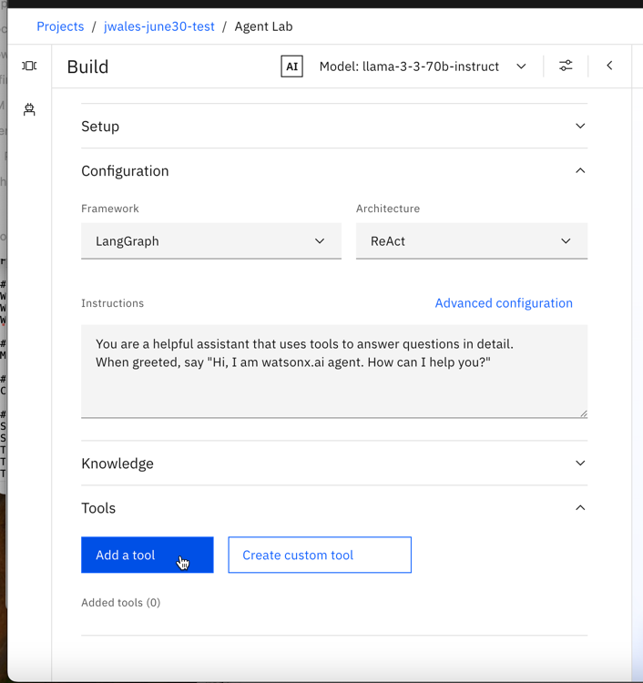
1. Enable `Google Search`by dragging the slider over and Click `X` to exit.
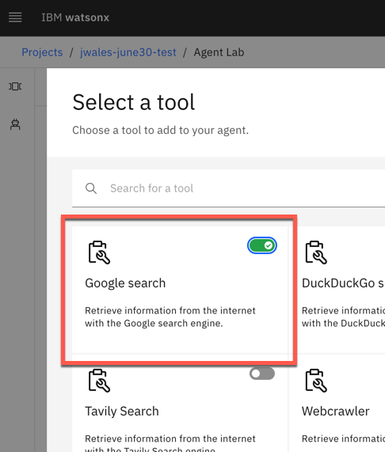
1. Click `Save as` in upper right
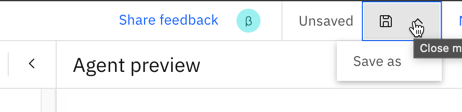
1. Save as `Agent` and click `Save`
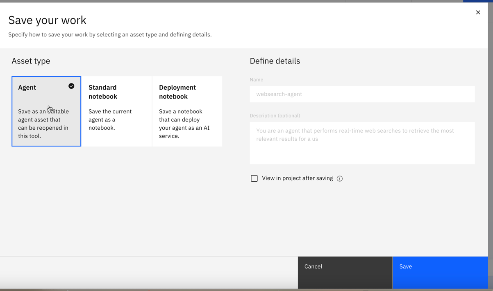
1. Test the agent by asking a question in the agent preview pane.  when it is responding as you expect, you are ready to deploy.
2. Click `Deploy` in upper right hand corner and select your deployment space.
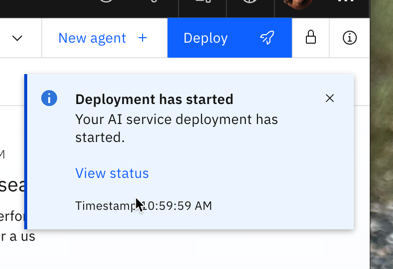
1. The deployment will start.  Click on `View Status` to go to the deployment space where you can monitor the deployment status. 
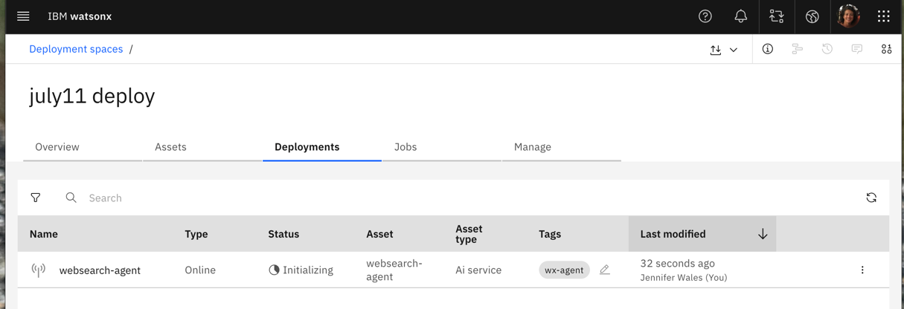
1. When the status changes to `Deployed`, click on the agent name `websearch-agent` to get to the endpoints for inferencing.
2.  Under Public Endpoint, copy the Agent's endpoint that includes `ai_service_stream` in it as shown below and paste to your text based reference.  You will use this in the next step.
    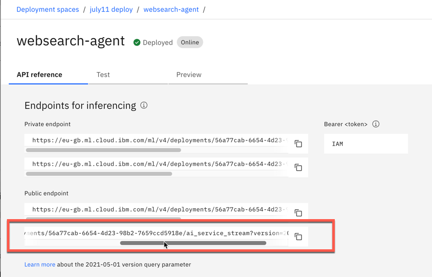

## 4. Integrate agent into watsonx Orchestrate

### 4.1 Create an agent in orchestrate
1. Open `watsonx orchestrate` from cloud resources:  https://cloud.ibm.com/resources
2. From the hamburger menu, go to `Build`, `Agent Builder`


3. Select `Create Agent +` button 
   * Select `Create from Scratch`
   * Name agent `Web Search` <Your Initials>`
   * Under Description enter `You are an agent that uses the Websearch-Agent to respond to user queries.`
   * Select `Create` button to create agent
   
4. Configure the Agent details.  
   * Scroll down to the `Toolset` section on the left hand side
   * Click on `Add agent` under Agents
    
   * Select `Import` option from the add a new agent popup.
    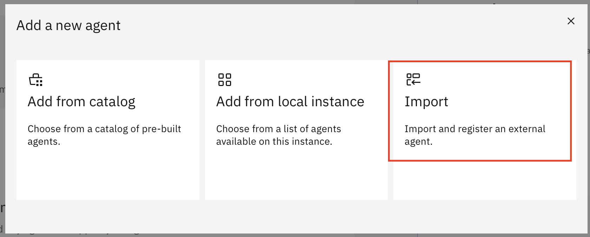
   * Select `External agent` and click `Next`.
    
5. Configure Import agent options
   * Choose `watsonx.ai` as provider since our Web Search agent is deployed on the watsonx.ai platform
   * Add your `Cloud API Key` from your text based reference under `API Key`
   * Under `Service instance URL` paste the deployment endpoint you copied earlier
   * Under `Display Name` add `Web-Search-<Your initials>`
   * Under `Description of agent capabilities` add:
  ```You are an agent that uses the Websearch-Agent to respond to user queries```
   * Select `Import Agent` to integrate the watsonx.ai agent.
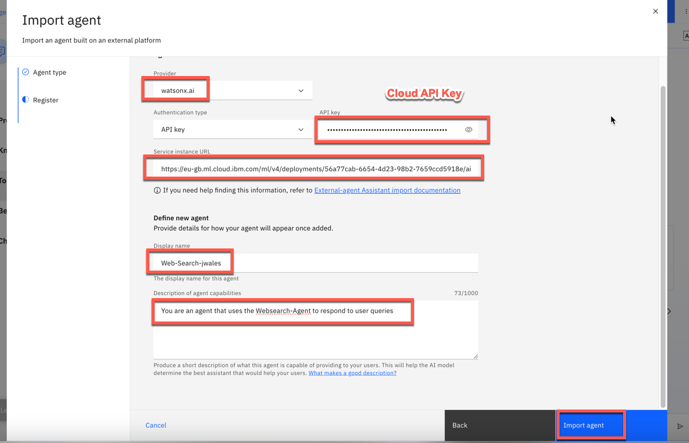

        The imported should now be listed in the agents section.
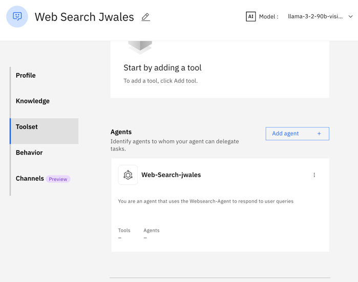

### 4.2 Deploy Agent
1. In the `Preview` section enter a greeting to start a chat from the right side chat window.
2. Enter the question:
 ```Summarize today's equity market headlines ```<br>

1. Click `Deploy` in the upper right hand corner, and `Deploy` to deploy the agent.

### 4.3 Test Agent
1. Under the Hamberger menu, go to `Chat` and select your deployed agent from the `Agents` drop down
2. Interact with the Agent by asking different variations of questions

