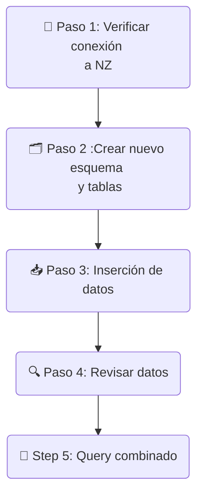

# Optimización del costo del Data Warehouse Netezza


> Ten en cuenta que los datos utilizados en este laboratorio son generados y no reflejan de ninguna manera el movimiento del mercado de valores.


## Table of content
- [Optimizing the Netezza Data Warehouse Cost](#optimizing-the-netezza-data-warehouse-cost)
  - [Table of content](#table-of-content)
  - [Prerequisites](#prerequisites)
  - [1. Objective:](#1-objective)
  - [2. Solution Approach:](#2-solution-approach)
  - [3. Netezza data schema](#3-netezza-data-schema)
  - [4. 🚀 Lab Flow](#4--lab-flow)
    - [4.1 - Check Netezza data source](#41---check-netezza-data-source)
    - [4.2 - Create New schema and tables in watsonx.data](#42---create-new-schema-and-tables-in-watsonxdata)
    - [4.3 - Insert Historic Data into watsonx.data](#43---insert-historic-data-into-watsonxdata)
    - [4.4 - Review the Data in watsonx.data](#44---review-the-data-in-watsonxdata)
    - [4.5 - Run Analytical Queries using the Presto engine](#45---run-analytical-queries-using-the-presto-engine)
  - [5. Review the Explain Plan](#5-review-the-explain-plan)
  - [6. How to improve the ETL / Query Design?](#6-how-to-improve-the-etl--query-design)


## Prerequisites
- Completed  [Environment Setup](/env-setup/README.md)


## 1. Objectivo: 
El objetivo de este laboratorio es demostrar cómo reducir el costo operativo de ejecutar el entorno de Data Warehouse. Además de reducir el costo operativo del Data Warehouse, los datos se unificarán en el **Open Hybrid Lakehouse**, plataforma **watsonx.data** para aplicaciones analíticas y de IA.

## 2. Enfoque de la solución: 
En este laboratorio, los datos históricos se descargarán del Data Warehouse (DW) de Netezza, base de datos `INVESTMENTS` y esquema `equity_transactions`, hacia el catálogo `iceberg_data` de watsonx.data. Los datos históricos se identifican en función de las transacciones realizadas antes de 2024. Al reducir el volumen de datos en el DW de Netezza, se disminuye el costoso almacenamiento en bloque, sustituyéndolo por **Cloud Object Storage**.

Los datos del año actual se mantienen en el Data Warehouse para minimizar la interrupción de las aplicaciones existentes. Utilizaremos el motor de consultas **Presto** para ejecutar consultas federadas que permitan agregar datos tanto de Netezza como de watsonx.data.

Todo el laboratorio se ejecutará en la interfaz **watsonx.data UI**, dentro del entorno **techzone** en el backend. 

## 3. Esquema de datos de Netezza

[Dataset description](./Data-description.md)

ebido a las limitaciones del entorno del laboratorio, realizaremos lo siguiente:

1. Ejecutar consultas federadas con Presto para descargar los datos del DW de Netezza.
2. Usar un esquema separado `equity_transactions_ly` en lugar de eliminar los datos históricos del DW, lo cual es el enfoque recomendado en entornos de producción.
3. Ejecutar consultas federadas sobre los datos actuales en Netezza (`equity_transactions_ly`) que contiene los datos del año en curso, y sobre los datos históricos en watsonx.data.


## 4. 🚀 Lab Flow



- **Paso 1 - Conexión a Netezza**: Verificar la conexión a Netezza;
-  **Paso 2 - Nuevo esquema y tablas**: Crear nuevo esquema y tablas en el catálogo `iceberg_data` para la descarga de datos;
-  **Paso 3 - Inserción de datos**: Insertar datos en las tablas recién creadas desde el esquema `INVESTMENTS` de Netezza, para transacciones históricas anteriores a 2025;
-   **Paso 4 - Revisar datos**: Verificar muestras de datos y número de registros en las tablas recién creadas;
-    **Paso 5 - Consulta combinada**: Ejecutar consultas que combinen los datos de las tablas iceberg en watsonx.data y el esquema del año actual, `equity_transactions_ly` en Netezza.

### 4.1 - Verificar la fuente de datos de Netezza

-  Desde IBM Cloud `Resource List` <https://cloud.ibm.com/resources>
-  Seleccionar la instancia de watsonx.data (en la sección Databases) en `wxdata-`
-  Abrir la consola web- Desde el menú Hamburguesa en la parte superior izquierda, seleccionar `Infrastructure Manager` y verificar que Netezza esté agregado como fuente de datos
- 
- Desde la hamburguesa en la parte superior izquierda, seleccionar `Data manager`
- Navegar por el catálogo nz_catalog y verificar que los esquemas de Netezza `equity_transactions` y `equity_transactions_ly` estén disponibles.


### 4.2 - Create New schema and tables in watsonx.data
1. From the Hamburger menu in the top left, go to `Query workspace` where you will be executing SQL queries.


2. Create schema for Netezza offload and tables in watsonx.data iceberg catalog where you will offload data on transactions from Netezza `EQUITY_TRANSACTIONS`. 
  
   *  Modify the SQL command below with your `<SCHEMA_DWH_OFFLOAD>` and  `WXD_BUCKET` values in your environment file and paste into the `Query Workspace` (values should be unique accross Cloud Account so you will have a different one).  
   *  For the bootcamp, the convention for <SCHEMA_DWH_OFFLOAD> is `netezza_offload_<YourName_First3LettersOfSurname>`

```sql
CREATE SCHEMA IF NOT EXISTS iceberg_data.<SCHEMA_DWH_OFFLOAD> WITH (location = 's3a://<WXD_BUCKET>/<SCHEMA_DWH_OFFLOAD>');
```
3. Check that query execution was successful:


4. Create tables in the newly added schema.
   
   * Modify the SQL command below with your `<SCHEMA_DWH_OFFLOAD>` value and paste into the `Query Workspace`.
   
```sql

-- dim_account
CREATE TABLE iceberg_data.<SCHEMA_DWH_OFFLOAD>.dim_account (
    account_id INTEGER,
    account_type VARCHAR,
    status VARCHAR,
    opening_date DATE,
    risk_level VARCHAR,
    balance DECIMAL(18, 2),
    margin_enabled BOOLEAN,
    trading_experience VARCHAR
)
WITH (
    format = 'PARQUET'
);

-- dim_stock
CREATE TABLE iceberg_data.<SCHEMA_DWH_OFFLOAD>.dim_stock (
    stock_id INTEGER,
    stock_symbol VARCHAR,
    stock_name VARCHAR,
    sector VARCHAR,
    industry VARCHAR,
    market_cap DECIMAL(18, 2)
)
WITH (
    format = 'PARQUET'
);

-- dim_exchange
CREATE TABLE iceberg_data.<SCHEMA_DWH_OFFLOAD>.dim_exchange (
    exchange_id INTEGER,
    exchange_name VARCHAR,
    country VARCHAR,
    timezone VARCHAR,
    currency VARCHAR
)
WITH (
    format = 'PARQUET'
);

-- dim_date
CREATE TABLE iceberg_data.<SCHEMA_DWH_OFFLOAD>.dim_date (
    date_id INTEGER,
    transaction_date DATE,
    year INTEGER,
    quarter INTEGER,
    month INTEGER,
    week INTEGER,
    day_of_week INTEGER,
    is_weekend BOOLEAN
)
WITH (
    format = 'PARQUET'
);

-- fact_transactions 
CREATE TABLE iceberg_data.<SCHEMA_DWH_OFFLOAD>.fact_transactions (
    transaction_id INTEGER,
    account_id INTEGER,
    stock_id INTEGER,
    date_id INTEGER,
    exchange_id INTEGER,
    order_type VARCHAR,
    quantity INTEGER,
    price DECIMAL(10,2),
    total_value DECIMAL(18,2)
)
WITH (
    format = 'PARQUET'
);
  ``` 

5. After creating tables, refresh `iceberg_data` catalog and check that schema and tables exist in the schema for data offload

<br>


### 4.3 - Insert Historic Data into watsonx.data

1. Insert data into created tables for Netezza filtered by year by using presto federated query
   
   * Modify the SQL command below with your `<SCHEMA_DWH_OFFLOAD>` value and paste into the `Query Workspace`.

```sql
-- Insert into dim_date
INSERT INTO iceberg_data.<SCHEMA_DWH_OFFLOAD>.dim_date
SELECT *
FROM nz_catalog.equity_transactions.dim_date dt
WHERE dt.year < year(CURRENT_DATE);

-- Insert into fact_transactions (filtered by dim_date)
INSERT INTO iceberg_data.<SCHEMA_DWH_OFFLOAD>.fact_transactions
SELECT ft.*
FROM nz_catalog.equity_transactions.fact_transactions ft
JOIN iceberg_data.<SCHEMA_DWH_OFFLOAD>.dim_date d ON ft.date_id = d.date_id;

-- Insert into dim_account (using filtered fact_transactions)
INSERT INTO iceberg_data.<SCHEMA_DWH_OFFLOAD>.dim_account
SELECT DISTINCT a.*
FROM nz_catalog.equity_transactions.dim_account a
JOIN iceberg_data.<SCHEMA_DWH_OFFLOAD>.fact_transactions ft ON a.account_id = ft.account_id;

-- Insert into dim_stock (using filtered fact_transactions)
INSERT INTO iceberg_data.<SCHEMA_DWH_OFFLOAD>.dim_stock
SELECT DISTINCT s.*
FROM nz_catalog.equity_transactions.dim_stock s
JOIN iceberg_data.<SCHEMA_DWH_OFFLOAD>.fact_transactions ft ON s.stock_id = ft.stock_id;

-- Insert into dim_exchange (using filtered fact_transactions)
INSERT INTO iceberg_data.<SCHEMA_DWH_OFFLOAD>.dim_exchange
SELECT DISTINCT e.*
FROM nz_catalog.equity_transactions.dim_exchange e
JOIN iceberg_data.<SCHEMA_DWH_OFFLOAD>.fact_transactions ft ON e.exchange_id = ft.exchange_id;
```

### 4.4 - Review the Data in watsonx.data

1. Generate SELECTs to view data sample in some tables 

    <br>

1. Count the number of rows transferred from Netezza
  
   * Modify the SQL command below with your `<SCHEMA_DWH_OFFLOAD>` value and paste into the `Query Workspace`.
```sql
SELECT 'transactions_count', COUNT(*) AS count
FROM  "iceberg_data"."<SCHEMA_DWH_OFFLOAD>"."fact_transactions" as ft

UNION

SELECT 'dates_count', COUNT(*) AS count
FROM "iceberg_data"."<SCHEMA_DWH_OFFLOAD>"."dim_date" as dd

UNION

SELECT 'stock_count', COUNT(*) AS count
FROM "iceberg_data"."<SCHEMA_DWH_OFFLOAD>"."dim_stock" as ds

UNION

SELECT 'exchanges_count', COUNT(*) AS count
FROM "iceberg_data"."<SCHEMA_DWH_OFFLOAD>"."dim_exchange" as de

UNION

SELECT 'accounts_count', COUNT(*) AS count
FROM "iceberg_data"."<SCHEMA_DWH_OFFLOAD>"."dim_account" as da;
```
Expected output:


Due to the lab limitations (we have only one Netezza instance for all participants) => we will use `equity_transactions_ly` where only current year (2025) data exists. The same schema and table definitions are identical to `equity_transactions` schema that we've offloaded in previous steps 4.3.

### 4.5 - Run Analytical Queries using the Presto engine

Now the data has be prepared and ready to be consumed by the business users and data scientists for analytical and AI purpose.  Let's develop some queries that will answer business questions listed below.

**Tip :** 

1. Use the `iceberg_data.<SCHEMA_DWH_OFFLOAD>` schema for the historic data and `nz_catalog.equity_transactions_ly` for the current data.
2. Make sure you are working from the `Query workspace`.


**Questions**:
1. Calculate top 10 accounts by the volume of traded per year.
2. Identify the Top 10 accounts by transaction value per year.
3. Determine the Average transaction price for each of the stocks, including current year (2025) trades.
4. Determine the Number of transactions the took place in each of exchange by year.
5. List all of the stocks traded by account_id, 215 during the year 2024 and 2025.


[**Solution Queries**](./Solution.md)

## 5. Review the Explain Plan
- From the watsonx.data left navigation menu select `Query History`.
- Select one of the query that you like to analyze
- Review the content in the Logical Execution Plan, Distributed Execution and Explain analyze tabs. 


## 6. How to improve the ETL / Query Design?

- Share an ETL or query design change that you think will help in improving the query performance.  Post your response in the Teams Chat.
