# Optimización del costo del Data Warehouse Netezza


> Ten en cuenta que los datos utilizados en este laboratorio son generados y no reflejan de ninguna manera el movimiento del mercado de valores.


## Tabla de contenido
- [Optimización del costo del Data Warehouse Netezza](#optimizacion-del-costo-del-data-warehouse-netezza)
  - [Tabla de contenido](#tabla-de-contenido)
  - [Prerrequisitos](#prerrequisitos)
  - [1. Objetivo:](#1-objetivo)
  - [2. Enfoque de la solución:](#2-enfoque-de-la-solución)
  - [3. Esquema de datos de Netezza](#3-esquema-de-datos-de-netezza)
  - [4. 🚀 Flujo del Lab](#4--flujo-del-lab)
    - [4.1 - Verificar la fuente de datos de Netezza](#41---verificar-la-fuente-de-datos-de-netezza)
    - [4.2 - Crear un nuevo esquema y tablas en watsonx.data](#42---crear-un-nuevo-esquema-y-tablas-en-watsonxdata)
    - [4.3 - Insertar datos históricos en watsonx.data](#43---insertar-datos-históricos-en-watsonxdata)
    - [4.4 - Revisar los datos en watsonx.data](#44---revisar-los-datos-en-watsonxdata)
    - [4.5 - Ejecutar consultas analíticas usando el motor Presto](#45---ejecutar-consultas-analíticas-usando-el-motor-presto)
  - [5. Revisar el Explain Plan](#5-revisar-el-explain-plan)
  - [6. ¿Cómo mejorar el diseño de ETL o consultas?](#6-¿cómo-mejorar-el-diseño-de-etl-o-consultas)


## Prerrequisitos
- Haber completado la [configuración de ambiente](/env-setup/README.md)


## 1. Objetivo: 
El objetivo de este laboratorio es demostrar cómo reducir el costo operativo de ejecutar el entorno de Data Warehouse. Además de reducir el costo operativo del Data Warehouse, los datos se unificarán en el **Open Hybrid Lakehouse**, plataforma **watsonx.data** para aplicaciones analíticas y de IA.

## 2. Enfoque de la solución: 
En este laboratorio, los datos históricos se descargarán del Data Warehouse (DW) de Netezza, base de datos `INVESTMENTS` y esquema `equity_transactions`, hacia el catálogo `iceberg_data` de watsonx.data. Los datos históricos se identifican en función de las transacciones realizadas antes de 2024. Al reducir el volumen de datos en el DW de Netezza, se disminuye el costoso almacenamiento en bloque, sustituyéndolo por **Cloud Object Storage**.

Los datos del año actual se mantienen en el Data Warehouse para minimizar la interrupción de las aplicaciones existentes. Utilizaremos el motor de consultas **Presto** para ejecutar consultas federadas que permitan agregar datos tanto de Netezza como de watsonx.data.

Todo el laboratorio se ejecutará en la interfaz **watsonx.data UI**, dentro del entorno **techzone** en el backend. 

## 3. Esquema de datos de Netezza

[Dataset description](./Data-description.md)

Debido a las limitaciones del entorno del laboratorio, realizaremos lo siguiente:

1. Ejecutar consultas federadas con Presto para descargar los datos del DW de Netezza.
2. Usar un esquema separado `equity_transactions_ly` en lugar de eliminar los datos históricos del DW, lo cual es el enfoque recomendado en entornos de producción.
3. Ejecutar consultas federadas sobre los datos actuales en Netezza (`equity_transactions_ly`) que contiene los datos del año en curso, y sobre los datos históricos en watsonx.data.


## 4. 🚀 Flujo del Lab

```mermaid
graph TD
    A(🔌 Paso 1: Verificar conexión <br>a NZ)
    A --> B(🗂️ Paso 2 :Crear nuevo esquema <br> y tablas)
    B --> C(📥 Paso 3: Inserción de datos)
    C --> D(🔍 Paso 4: Revisar datos)
    D --> E(🧠  Paso 5: Query combinado)
```



- **Paso 1 - Conexión a Netezza**: Verificar la conexión a Netezza;
-  **Paso 2 - Nuevo esquema y tablas**: Crear nuevo esquema y tablas en el catálogo `iceberg_data` para la descarga de datos;
-  **Paso 3 - Inserción de datos**: Insertar datos en las tablas recién creadas desde el esquema `INVESTMENTS` de Netezza, para transacciones históricas anteriores a 2025;
-   **Paso 4 - Revisar datos**: Verificar muestras de datos y número de registros en las tablas recién creadas;
-    **Paso 5 - Consulta combinada**: Ejecutar consultas que combinen los datos de las tablas iceberg en watsonx.data y el esquema del año actual, `equity_transactions_ly` en Netezza.

### 4.1 - Verificar la fuente de datos de Netezza

-  Desde IBM Cloud `Resource List` <https://cloud.ibm.com/resources>
-  Seleccionar la instancia de watsonx.data (en la sección Databases) en `wxdata-`
-  Abrir la consola web
-  Desde el menú Hamburguesa en la parte superior izquierda, seleccionar `Infrastructure Manager` y verificar que Netezza esté agregado como fuente de datos
- 
- Desde la hamburguesa en la parte superior izquierda, seleccionar `Data manager`
- Navegar por el catálogo nz_catalog y verificar que los esquemas de Netezza `equity_transactions` y `equity_transactions_ly` estén disponibles.


### 4.2 - Crear un nuevo esquema y tablas en watsonx.data
1. Desde el menú Hamburguesa en la esquina superior izquierda, ve a `Query workspace`, donde ejecutarás las consultas SQL.


2. Crea el esquema para la descarga de Netezza y las tablas en el catálogo iceberg de watsonx.data donde descargarás datos de transacciones desde Netezza `EQUITY_TRANSACTIONS`. 
  
   *  Modifica el comando SQL a continuación con tus valores `<SCHEMA_DWH_OFFLOAD>` y `WXD_BUCKET` en tu archivo de entorno y pégalo en el `Query Workspace` (los valores deben ser únicos en la cuenta de Cloud, así que tendrás uno diferente).  
   *  Para el bootcamp, la convención para <SCHEMA_DWH_OFFLOAD> es `netezza_offload_<YourName_First3LettersOfSurname>`

```sql
CREATE SCHEMA IF NOT EXISTS iceberg_data.<SCHEMA_DWH_OFFLOAD> WITH (location = 's3a://<WXD_BUCKET>/<SCHEMA_DWH_OFFLOAD>');
```
3. Verifica que la ejecución de la consulta fue exitosa:


4. Crea las tablas en el esquema recién agregado.
   
   * Modifica el comando SQL a continuación con tu valor `<SCHEMA_DWH_OFFLOAD>` y pégalo en el `Query Workspace`.
   
```sql

-- dim_account
CREATE TABLE iceberg_data.<SCHEMA_DWH_OFFLOAD>.dim_account (
    account_id INTEGER,
    account_type VARCHAR,
    status VARCHAR,
    opening_date DATE,
    risk_level VARCHAR,
    balance DECIMAL(18, 2),
    margin_enabled BOOLEAN,
    trading_experience VARCHAR
)
WITH (
    format = 'PARQUET'
);

-- dim_stock
CREATE TABLE iceberg_data.<SCHEMA_DWH_OFFLOAD>.dim_stock (
    stock_id INTEGER,
    stock_symbol VARCHAR,
    stock_name VARCHAR,
    sector VARCHAR,
    industry VARCHAR,
    market_cap DECIMAL(18, 2)
)
WITH (
    format = 'PARQUET'
);

-- dim_exchange
CREATE TABLE iceberg_data.<SCHEMA_DWH_OFFLOAD>.dim_exchange (
    exchange_id INTEGER,
    exchange_name VARCHAR,
    country VARCHAR,
    timezone VARCHAR,
    currency VARCHAR
)
WITH (
    format = 'PARQUET'
);

-- dim_date
CREATE TABLE iceberg_data.<SCHEMA_DWH_OFFLOAD>.dim_date (
    date_id INTEGER,
    transaction_date DATE,
    year INTEGER,
    quarter INTEGER,
    month INTEGER,
    week INTEGER,
    day_of_week INTEGER,
    is_weekend BOOLEAN
)
WITH (
    format = 'PARQUET'
);

-- fact_transactions 
CREATE TABLE iceberg_data.<SCHEMA_DWH_OFFLOAD>.fact_transactions (
    transaction_id INTEGER,
    account_id INTEGER,
    stock_id INTEGER,
    date_id INTEGER,
    exchange_id INTEGER,
    order_type VARCHAR,
    quantity INTEGER,
    price DECIMAL(10,2),
    total_value DECIMAL(18,2)
)
WITH (
    format = 'PARQUET'
);
  ``` 

5. Después de crear las tablas, actualiza el catálogo `iceberg_data` y verifica que el esquema y las tablas existan en el esquema para la descarga de datos

<br>


### 4.3 - Insertar datos históricos en watsonx.data

1. Inserta datos en las tablas creadas para Netezza filtrados por año utilizando una consulta federada de Presto
   
   * Modifica el comando SQL a continuación con tu valor `<SCHEMA_DWH_OFFLOAD>` y pégalo en el `Query Workspace`.

```sql
-- Insert into dim_date
INSERT INTO iceberg_data.<SCHEMA_DWH_OFFLOAD>.dim_date
SELECT *
FROM nz_catalog.equity_transactions.dim_date dt
WHERE dt.year < year(CURRENT_DATE);

-- Insert into fact_transactions (filtered by dim_date)
INSERT INTO iceberg_data.<SCHEMA_DWH_OFFLOAD>.fact_transactions
SELECT ft.*
FROM nz_catalog.equity_transactions.fact_transactions ft
JOIN iceberg_data.<SCHEMA_DWH_OFFLOAD>.dim_date d ON ft.date_id = d.date_id;

-- Insert into dim_account (using filtered fact_transactions)
INSERT INTO iceberg_data.<SCHEMA_DWH_OFFLOAD>.dim_account
SELECT DISTINCT a.*
FROM nz_catalog.equity_transactions.dim_account a
JOIN iceberg_data.<SCHEMA_DWH_OFFLOAD>.fact_transactions ft ON a.account_id = ft.account_id;

-- Insert into dim_stock (using filtered fact_transactions)
INSERT INTO iceberg_data.<SCHEMA_DWH_OFFLOAD>.dim_stock
SELECT DISTINCT s.*
FROM nz_catalog.equity_transactions.dim_stock s
JOIN iceberg_data.<SCHEMA_DWH_OFFLOAD>.fact_transactions ft ON s.stock_id = ft.stock_id;

-- Insert into dim_exchange (using filtered fact_transactions)
INSERT INTO iceberg_data.<SCHEMA_DWH_OFFLOAD>.dim_exchange
SELECT DISTINCT e.*
FROM nz_catalog.equity_transactions.dim_exchange e
JOIN iceberg_data.<SCHEMA_DWH_OFFLOAD>.fact_transactions ft ON e.exchange_id = ft.exchange_id;
```

### 4.4 - Revisar los datos en watsonx.data

1. Genera SELECTs para ver muestras de datos en algunas tablas 

    <br>

1. Cuenta el número de filas transferidas desde Netezza
  
   * Modifica el comando SQL a continuación con tu valor `<SCHEMA_DWH_OFFLOAD>` y pégalo en el `Query Workspace`.
```sql
SELECT 'transactions_count', COUNT(*) AS count
FROM  "iceberg_data"."<SCHEMA_DWH_OFFLOAD>"."fact_transactions" as ft

UNION

SELECT 'dates_count', COUNT(*) AS count
FROM "iceberg_data"."<SCHEMA_DWH_OFFLOAD>"."dim_date" as dd

UNION

SELECT 'stock_count', COUNT(*) AS count
FROM "iceberg_data"."<SCHEMA_DWH_OFFLOAD>"."dim_stock" as ds

UNION

SELECT 'exchanges_count', COUNT(*) AS count
FROM "iceberg_data"."<SCHEMA_DWH_OFFLOAD>"."dim_exchange" as de

UNION

SELECT 'accounts_count', COUNT(*) AS count
FROM "iceberg_data"."<SCHEMA_DWH_OFFLOAD>"."dim_account" as da;
```
Salida esperada:


Debido a las limitaciones del laboratorio (solo tenemos una instancia de Netezza para todos los participantes), utilizaremos `equity_transactions_ly`, donde solo existen los datos del año en curso (2025). El esquema y las definiciones de tablas son idénticos al esquema `equity_transactions` que descargamos en los pasos 4.3 anteriores.

### 4.5 - Ejecutar consultas analíticas usando el motor Presto

Ahora los datos están preparados y listos para que los usuarios de negocio y los data scientists los consuman con fines analíticos y de IA. Desarrollemos algunas consultas que responderán las preguntas de negocio que se listan a continuación.

**Tip:** 

1. Usa el esquema `iceberg_data.<SCHEMA_DWH_OFFLOAD>` para los datos históricos y `nz_catalog.equity_transactions_ly` para los datos actuales.
2. Asegúrate de trabajar desde el `Query workspace`.


**Preguntas**:
1. Calcular el top 10 de cuentas por volumen negociado por año.
2. Identificar el top 10 de cuentas por valor de transacción por año.
3. Determinar el precio promedio de transacción para cada acción, incluyendo las operaciones del año actual (2025).
4. Determinar el número de transacciones que tuvieron lugar en cada bolsa por año.
5. Listar todas las acciones negociadas por la `account_id` 215 durante los años 2024 y 2025.


[**Solution Queries**](./Solution.md)

## 5. Revisar el Explain Plan
- Desde el menú de navegación izquierdo de watsonx.data selecciona `Query History`.
- Selecciona una de las consultas que quieras analizar.
- Revisa el contenido en las pestañas Logical Execution Plan, Distributed Execution y Explain analyze. 


## 6. ¿Cómo mejorar el diseño de ETL o consultas?

- Comparte un cambio de ETL o de diseño de consultas que creas que ayudará a mejorar el rendimiento. Publica tu respuesta en el chat de Teams.
