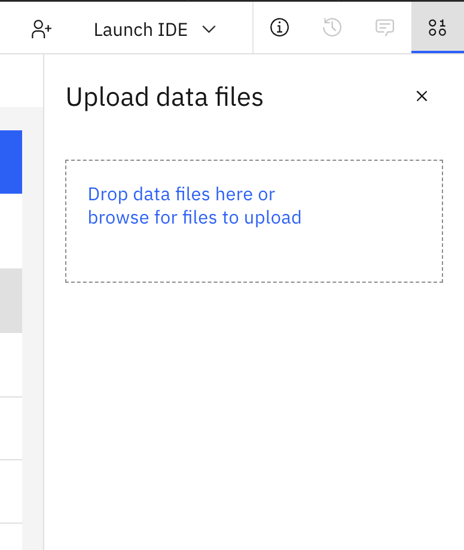

# Data Lakehouse

> Nota: todos los datos usados en el lab son generados y no reflejan en absoluto la situación de los mercados bursátiles.

- [Data Lakehouse](#data-lakehouse)
  - [1. Introducción](#1-introducción)
      - [Presto](#presto)
      - [Spark](#spark)
  - [2.  Prerrequisitos](#2--prerrequisitos)
  - [3. Descripción general de datos](#3-descripción-general-de-datos)
  - [4. Resultado esperado](#4-resultado-esperado)
  - [5. Inserción de datos con Presto](#5-inserción-de-datos-con-presto)
    - [5.1 Abrir el proyecto watsonx.ai (Labs Techzone Environment)](#51-abrir-el-proyecto-watsonxai-labs-techzone-environment)
    - [5.2 Importar el Jupyter Notebook con el script desde la carpeta local](#52-importar-el-jupyter-notebook-con-el-script-desde-la-carpeta-local)
    - [5.3 Abrir y ejecutar el Jupyter Notebook](#53-abrir-y-ejecutar-el-jupyter-notebook)
    - [5.4 Revisar los datos en la UI de watsonx.data después de la parte de Presto del lab (watsonx.data back-end Techzone Environment)](#54-revisar-los-datos-en-la-ui-de-watsonxdata-después-de-la-parte-de-presto-del-lab-watsonxdata-back-end-techzone-environment)
  - [6. Preprocesamiento con Spark: enviar app de spark en la UI de watsonx.data](#6-preprocesamiento-con-spark-enviar-app-de-spark-en-la-ui-de-watsonxdata)
    - [6.1 Guardar el script de spark en el bucket de COS y generar el payload json](#61-guardar-el-script-de-spark-en-el-bucket-de-cos-y-generar-el-payload-json)
    - [6.2 Abrir y ejecutar el Jupyter Notebook](#62-abrir-y-ejecutar-el-jupyter-notebook)
    - [6.3 Enviar la app de spark en la UI de watsonx.data (watsonx.data back-end Techzone Environment)](#63-enviar-la-app-de-spark-en-la-ui-de-watsonxdata-watsonxdata-back-end-techzone-environment)
    - [6.4 Verificar el estado](#64-verificar-el-estado)
    - [6.5 Revisar los datos en la UI de watsonx.data después del procesamiento con spark](#65-revisar-los-datos-en-la-ui-de-watsonxdata-después-del-procesamiento-con-spark)

## 1. Introducción

El :dart: **propósito** de este lab es demostrar:
- Flujo de trabajo con catálogos hive e iceberg para manejar diferentes tareas de datos.
- Soporte de federación de datos para consumirlos desde la fuente en lugar de crear copias adicionales. 
- Uso del motor adecuado (Spark) para transformar, agregar y depurar datos con el fin de exponer datos de alta calidad para aplicaciones analíticas y de IA.

#### Presto
En `Presto data insertion` primero :memo: registrarás datos ubicados en el bucket de hive en el catálogo hive como tablas externas y luego :inbox_tray: ingerirás parte de los datos en el catálogo iceberg (accounts table) asociado con el motor presto. 

#### Spark
En los pasos de Spark `Spark pre-processing` prepararás la tabla holdings :clipboard: para 2024 y acciones específicas basándote en las tablas descargadas en el Lab 1 desde Netezza. Luego, las holdings de 2024 se combinarán con las holdings hasta 2023 que contienen un conjunto predefinido de acciones para obtener la `holdings_table` total que se usará más adelante junto con `accounts_table` en el Agentic Flow. La tabla de Postgres `bankdemo.customers_table` está federada a watsonx.data `postgres_catalog` como parte de los prerrequisitos y no requiere cambios adicionales; se usará tal cual en el Agentic Flow.

## 2.  Prerrequisitos
- Haber completado la [configuración de ambiente](/env-setup/README.md)
- Haber completado el Lab 1

## 3. Descripción general de datos

**:card_file_box: Fuentes de datos**

- Archivos en el bucket hive de COS
  - Ve a tu instancia de COS https://cloud.ibm.com/objectstorage/instances -> selecciona el bucket que inicia con `hive`, como `hive-1753085729998611476` -> busca el directorio `input_data_hive`; allí deberías encontrar carpetas/archivos precargados por el instructor, si no es así, repórtalo:
    - `accounts_ht` contiene la lista de account ids y customer ids del volcado del sistema interno;
    - `holdings_ht` contiene información sobre cuentas y sus holdings de acciones (únicas por account_id y asset_ticker) para el periodo previo hasta 2023, donde `asset_ticker` es el símbolo de la acción, `holding_amt` es el monto total de una acción específica y `tax_liability` es la obligación fiscal pendiente;
    - `tax_liability_ht` contiene la tasa de impuestos específica por país;
- Esquema de watsonx.data
  - `iceberg_data.<SCHEMA_DWH_OFFLOAD>` contiene datos descargados desde Netezza;
  - `postgres_catalog.bankdemo.customers_table` es una tabla de Postgres federada que contiene datos de clientes.
  
## 4. Resultado esperado

Al final del lab deberías tener 2 tablas en `clients_schema_YourName_First3LettersOfSurname` preparadas que luego se usarán en un Agentic Flow en el Lab5.

## 5. Inserción de datos con Presto 

### 5.1 Abrir el proyecto watsonx.ai (Labs Techzone Environment)
1. Abre el servicio de watsonx.ai Studio: en la [Cloud Resource list](https://cloud.ibm.com/resources) selecciona los recursos de `AI / Machine Learning` -> servicio `watsonx.ai Studio` -> abrir en `IBM watsonx`
 
2. Inicia sesión y desde la página de acceso rápido -> `Recent work` selecciona el proyecto que creaste durante la [configuración de ambiente](/env-setup/README.md).

3. Verifica que puedas ver el archivo env.txt en la lista de todos los assets en la pestaña `Assets`
, si no aparece, súbelo como data file.
 
4. Verifica que las conexiones estén disponibles, las usaremos en el lab

### 5.2 Importar el Jupyter Notebook con el script desde la carpeta local

1. Ve a los Assets del proyecto y selecciona `New asset +`:

2. Selecciona el tipo de asset `Work with data and models in Python or R notebooks`

3. Importa el Jupyter Notebook desde un archivo local:

4. Selecciona `Lab2_Data_Lakehouse/wx-ai-lab2/1_presto_wxai.ipynb`

5. Agrega al nombre tus iniciales: `-name-first3lettersSurname` y haz clic en `Create`

### 5.3 Abrir y ejecutar el Jupyter Notebook

1. Debería abrirse automáticamente justo después de crearlo; si no, ve a `Your Project` -> `Assets`:
    * haz clic en el Jupyter Notebook
    * y luego haz clic en el lápiz para editar; se abrirá el Jupyter Notebook en modo edición
     

2. Confirma como confiable el Jupyter Notebook en la esquina superior derecha:
  
3. Agrega un Project Token para acceder a los assets del proyecto

     * Haz clic en la segunda celda con imports para activarla
     * Inserta una celda debajo haciendo clic en el signo `+`
    
     * En el menú superior selecciona los 3 puntos para insertar el snippet de project token:
    
     * Ahora debería verse así (el orden es importante):
    
4. Ejecuta todas las celdas consecutivamente comenzando por la instalación de paquetes en la primera celda y revisa las salidas

### 5.4 Revisar los datos en la UI de watsonx.data después de la parte de Presto del lab (watsonx.data back-end Techzone Environment)

1. En otra ventana, abre el servicio de watsonx.data 

2. Desde el menú Hamburguesa en la esquina superior izquierda ve a `Data manager`

3. Verifica que se hayan agregado tablas en `hive_catalog.input_data_hive_YourName_First3LettersOfSurname`
 

4. Verifica que `accounts_table` se haya agregado a `iceberg_catalog.clients_schema_YourName_First3LettersOfSurname`

## 6. Preprocesamiento con Spark: enviar app de spark en la UI de watsonx.data 

### 6.1 Guardar el script de spark en el bucket de COS y generar el payload json

1.  Regresa al proyecto watsonx.ai que creaste durante la [configuración de ambiente](/env-setup/README.md)

2. Carga el script en el proyecto:
     * Desde la pestaña `Assets` haz clic en `Import assets`
  
     * Selecciona `Local file` -> `Data asset` -> `Browse`  
     * Desde los archivos locales bajo Lab2_Data_Lakehouse, selecciona el script `/wx-ai-lab2/spark-processing.py` y haz clic en `Open`
  
     * Una vez cargado, haz clic en `Done`
  
     * Deberías ver el script en la lista de assets disponibles (`Data`)

  1. Importa el Jupyter Notebook [./wx-ai-lab2/2_prepare-spark-app-submission_wxai.ipynb](./2_prepare-spark-app-submission_wxai.ipynb) desde la carpeta local al proyecto:
     * Ve a los Assets del proyecto y selecciona `New asset +`:
  
      * Selecciona el tipo de asset `Work with data and models in Python or R notebooks`
  

     * Importa el Jupyter Notebook desde un archivo local:

     * Selecciona [./wx-ai-lab2/2_prepare-spark-app-submission_wxai.ipynb](./2_prepare-spark-app-submission_wxai.ipynb) desde la carpeta local

     * Agrega al nombre tus iniciales: `-name-first3lettersSurname` y haz clic en `Create`
  

  ### 6.2 Abrir y ejecutar el Jupyter Notebook

  1. Debería abrirse automáticamente justo después de crearlo; si no, ve a `Your Project` -> `Assets`:
      * haz clic en el Jupyter Notebook
      * y luego haz clic en el lápiz para editar; se abrirá el Jupyter Notebook en modo edición
       
  2. Márcalo como confiable haciendo clic en `Not Trusted` en la esquina superior derecha y luego en `Trust`:
  

  3. Agrega un Project Token para acceder a los assets del proyecto
    * Haz clic en la primera celda con imports para activarla
    * Inserta una celda debajo haciendo clic en el signo `+`
    
    * En el menú superior selecciona los 3 puntos para insertar el snippet de project token:
    
    * Ahora debería verse así (el orden es importante):
    

4. Ejecuta todas las celdas consecutivamente comenzando por la instalación de paquetes en la primera celda y revisa las salidas
   
  * :warning: El notebook solicitará una Cloud API Key. Cuando lo haga, pega la `watsonx.data back-end Cloud API key` proporcionada por el instructor y presiona `Enter`. No uses tu CLOUD_API_KEY de cliente aquí.   
  * Una ejecución exitosa incluirá el payload para tu envío de la app de spark en la última celda en formato json.  
  * Copia el `payload` en tu nota de referencia; lo usarás para enviar tu app de spark.  

### 6.3 Enviar la app de spark en la UI de watsonx.data (watsonx.data back-end Techzone Environment)
1. Regresa al servicio de watsonx.data.
2. Desde el menú Hamburguesa en la esquina superior izquierda ve a `Infrastructure manager` 
3. Haz clic en el motor `Spark`
4. Ve a la pestaña `Spark history` y asegúrate de que el servidor de historia de spark esté iniciado; si no, inícialo con la configuración predeterminada.
5. Ve a la pestaña `Applications` y haz clic en `Create application +`

1. Ve a la pestaña `Payload` y pega el payload (salida json) del Jupyter Notebook (el que guardaste en tu nota de referencia)

1. Ve a la pestaña `Inputs` y, en la esquina superior derecha, haz clic en `Import from payload +`

1. Completa los parámetros restantes: 
     * Application type - Python
     * Application name - `spark-processing`
     * Spark version - 3.5
  
1. Haz clic en `Submit application`

### 6.4 Verificar el estado

1. Aparecerá una nueva app en la lista de Applications.  
   * Toma nota del `ID` de tu Spark Job en el entorno compartido. Lo usarás más tarde para encontrar tus logs de spark.
   * Para actualizar el estado, presiona el ícono de refrescar en el menú superior.
 

2. Revisa los event logs con el estado detallado de los jobs en `Spark history`:

     * Haz clic en la app más reciente.
     * Explora Jobs, Stages, SQL/DataFrame.

3. Opcionalmente, revisa los logs detallados en el bucket de COS conectado a Spark.  

  * Ve a la pestaña `Details` y encuentra el bucket listado en `Engine home` 

  * Consulta env.txt para el nombre real de tu bucket, por ejemplo: `WXD_BUCKET="wxd2-bucket-gxcrxaku11w09z0"`
  * Abre el servicio de Cloud Object Storage desde el entorno back-end de watsonx.data Techzone.
  * Desplázate hacia abajo y abre el bucket.  
  * En la barra de búsqueda, escribe `Spark` y cambia a la vista de carpetas.
  
  * Navega la carpeta Spark: `spark` -> `spark engine id` -> `logs` -> busca por tu app id -> spark-driver log -> descárgalo

### 6.5 Revisar los datos en la UI de watsonx.data después del procesamiento con spark

1. Desde el menú Hamburguesa en la esquina superior izquierda ve a `Data manager`

2. Verifica que `holdings_table` esté disponible en `iceberg_data."clients_schema_YourName_First3LettersOfSurname"`

