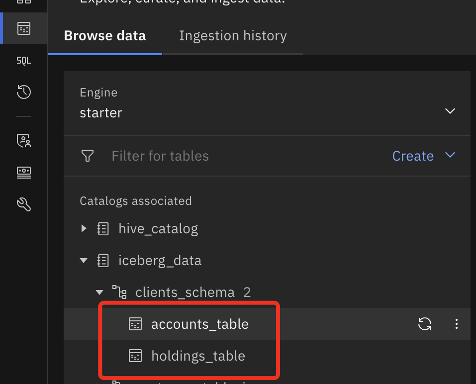

# Data Lakehouse

> Note all of the  data used in the lab is generated and does not in any way reflect situation on the stock markets

- [Data Lakehouse](#data-lakehouse)
  - [1. Introduction](#1-introduction)
      - [Presto](#presto)
      - [Spark](#spark)
  - [2.  Prerequisites](#2--prerequisites)
  - [3. Data overview](#3-data-overview)
  - [4. Expected outcome](#4-expected-outcome)
  - [5. Presto Data Insertion](#5-presto-data-insertion)
    - [5.1 Open watsonx.ai project and check `env.txt` file](#51-open-watsonxai-project-and-check-envtxt-file)
    - [1.2 Import Jupyter Notebook with the script from local folder](#12-import-jupyter-notebook-with-the-script-from-local-folder)
    - [1.3 Run the Jupyter Notebook](#13-run-the-jupyter-notebook)
    - [1.4 Review data in watsonx.data UI after Presto part of the lab](#14-review-data-in-watsonxdata-ui-after-presto-part-of-the-lab)
  - [2 Spark pre-processing: submit spark app in watsonx.data UI](#2-spark-pre-processing-submit-spark-app-in-watsonxdata-ui)
    - [2.1 Prerequisites: save spark script to COS bucket and generate payload json](#21-prerequisites-save-spark-script-to-cos-bucket-and-generate-payload-json)
    - [2.2 Submit spark app in watsonx.data UI](#22-submit-spark-app-in-watsonxdata-ui)
    - [2.3 Review data in watsonx.data UI after spark processing](#23-review-data-in-watsonxdata-ui-after-spark-processing)

## 1. Introduction

The :dart:**purpose** of this Lab is to demonstrate watsonx.data capablities to :
- Workflow with hive and iceberg catalogs to handle different workflows.
- Support for data federation so that data can be consumed from it's source rather than making additional copies. 
- Choose the fit for purpose engine (Spark) to Transform, aggregate and cleanse the data in-order to expose high quality data for Analytical and AI applications.

#### Presto
In `Presto data insertion` you will first :memo: register data located in hive bucket to hive catalog as external tables, then :inbox_tray: ingest some of the data into iceberg catalog (accounts table) associated with the presto engine. 

#### Spark
In the Spark steps `Spark pre-processing` you will prepare holdings table :clipboard: for 2024 and particular stocks based on tables offloaded in Lab 1 from Netezza. Then holdings for 2024 will be combined with holdings up to 2023 containing pre-defined set of stocks to get total `holdings_table` that will later be used along with `accounts_table` in Agentic Flow. Postgres `bankdemo.customers_table` is federated to watsonx.data `postgres_catalog` as part of the pre-requisites and does not require any additional changes and will be used AS IS in Agentic Flow.

## 2.  Prerequisites
- Completed  [Environment Setup](env-setup/wealth-mgr-env-setup.md)
- env.txt 
- Completed [Lab 1](../Lab1_Data_Warehouse_Optimization/Lab_1_Data_Offload_Guide.md).

## 3. Data overview

**:card_file_box: Sources of data**

- files in [/data](./vscode-lab2/data/) folder for `local-vscode-labs-dev` option and in [/input_data_hive](./wx-ai-lab2/input_data_hive/) folder for `wx-ai-lab2` option
  - `accounts.csv` / `accounts.parquet` contains the list of account ids and customer ids from the internal system dump;
  - `holdings_up_2023.csv` / `holdings_up_2023.parquet`contains information on accounts and their stock holdings (unique by account_id and asset_ticker) for the previous period up to 2023, where `asset_ticker` is stock symbol, `holding_amt` is the total amount of a particular stock and `tax_liability` is the remaining tax liability still owed;
  - `tax_liability.json` contains country specific tax rate;
- watsonx.data schema
  - `iceberg_data.<SCHEMA_DWH_OFFLOAD>` contains data offloaded from Netezza;
  - `postgres_catalog.bankdemo.customers_table` is a federated postgres table that contains customer data.
  
## 4. Expected outcome

At the end of the lab you should have 2 tables in  `clients_schema_YourName_First3LettersOfSurname` prepared that will be later used by an agentic flow in Lab5.

 

## 5. Presto Data Insertion 

### 5.1 Open watsonx.ai project and check `env.txt` file
* From [Cloud Resource list](https://cloud.ibm.com/resources) select `AI / Machine Learning` resources -> `watsonx.ai Studio` service -> open in `IBM watsonx`

* Login and from the quick access page -> `Recent work` Select the project you created during [Prerequisites/3. watsonx.ai setup.md](../../Prerequisites/3.%20watsonx.ai%20setup.md).

* Check that you can see env.txt file in the list of all assets on `Assets` tab

* Connections, in particular, Presto and COS should be available, we will be using them in the lab

### 1.2 Import Jupyter Notebook with the script from local folder

* Go to project Assets, select `New asset +`:

* Select `Work with data and models in Python or R notebooks` asset type

* Import Jupyter Notebook from local file:

* Select `Lab2_Data_Lakehouse/wx-ai-lab2/1_presto_wxai.ipynb`

* Append name with your initials: `-name-first3lettersSurname` and click `Create`

* Trust the Jupyter Notebook: select `Non Trusted` in the right upper corner, then `Trust`

### 1.3 Run the Jupyter Notebook

* You will need to insert a cell with project token to reach assets from the Project
  * Click on the second cell with import so it's active
  * Insert cell below by clicking on `+` sign
  
  * From the upper menu select 3 dots sign to insert a project token snippet:
  
  * So now it should look like this (sequence is important):
  
* Now run all cells consequtively starting from packages installations in the first cell and check outputs

### 1.4 Review data in watsonx.data UI after Presto part of the lab

* Go to watsonx.data UI `Data manager`

* Check whether tables were added to `hive_catalog.input_data_hive_YourName_First3LettersOfSurname`

* In `iceberg_data."clients_schema_YourName_First3LettersOfSurname"` accounts_table should be added

## 2 Spark pre-processing: submit spark app in watsonx.data UI

### 2.1 Prerequisites: save spark script to COS bucket and generate payload json

You will continue working in watsonx.ai project that you have created within [Prerequisites step 3](../../Prerequisites/3.%20watsonx.ai%20setup.md) and started to work on in Presto part here. In case you don't have Project open, repeat the steps from [2.1.2 Make sure that .env\_all file was created and contains required credentials](#212-make-sure-that-env_all-file-was-created-and-contains-required-credentials).

First, you will need to load necessary files/scripts to the Project:
* Upload [./wx-ai-lab2/spark-processing.py](./spark-processing.py) into the Project:
  * From `Assets` Tab click `Import assets`
  
  * Select `Local file` -> `Data asset` -> `Browse`  
  * From local files under Lab2_Data_Lakehouse/wx-ai-lab2, select `spark-processing.py` script and click `Open`
  
  * Once loaded, click `Done`
  
  * You should see the scrpt in the list of assets available (`Data`)

* Import Jupyter Notebook [./wx-ai-lab2/2_prepare-spark-app-submission_wxai.ipynb](./2_prepare-spark-app-submission_wxai.ipynb) from local folder into the Project:
  * Go to project Assets, select `New asset +`:
  

  * Select `Work with data and models in Python or R notebooks` asset type
  

  * Import Jupyter Notebook from local file:

  * Select [./wx-ai-lab2/2_prepare-spark-app-submission_wxai.ipynb](./2_prepare-spark-app-submission_wxai.ipynb) from local folder

  * Append name with your initials: `-name-first3lettersSurname` and click `Create`
  
  * Trust Jupyter Notebook by clicking `Not Trusted` in the right upper corner and then `Trust`:
  

* Run the Jupyter Notebook

  * Insert the project token to allow the notebook to access assets from the Project
    * Click on the first cell with import so it's active
    * Insert cell below by clicking on `+` sign
    
    * From the upper menu select 3 dots sign to insert a project token snippet:
    
    * So now it should look like this (sequence is important):
    

  * Now run all cells consecutively starting from packages import in the first cell and check outputs
    * :warning: it will prompt you to enter you Cloud API Key, do it please so that it can be used in the code (<CLOUD_API_KEY>) and press `Enter`
  * If all run successfully, you should receive print output from the last cell in json format, copy it to the reference note -> it will be a payload to your spark app submission

### 2.2 Submit spark app in watsonx.data UI
Now you need to open watsonx.data UI: from [Cloud Resource list](https://cloud.ibm.com/resources) in `Databases` find your watsonx.data instance, Select -> `Open web console`

* In `Infrastructure manager` click on spark engine
* In Spark history tab make sure that spark history server has started, if not start with the default configuration
* In `Applications` Tab click on `Create application +`

* To `Payload` tab copy json output from Juyter Notebook (that you've saved to your Reference Note)

* Go to `Inputs` Tab and in the right upper corner click in `Import from payload +`

* You should see that some of the parameters were added, you'll need to fill in the rest needed:
  * Application type - Python
  * Application name - `spark-processing`
  * Spark version - 3.5
  
* Now click `Submit application`
* A new app will appear in the Applications list, where you can follow it's status, to update press on update sign in upper menu
* 
* You can check event logs with detailed status of jobs in `Spark history`:

  * click on the latest app
  * there you can explore Jobs, Stages, SQL/DataFrame
* Logs are available in the connected COS bucket with spark metadata, in engine details you can find :warning: `Engine home`, for me it's connected hive bucket, it can be wx bucket in your case

  * The name of the bucket corresponds to the name in the watsonx.data `Infrastructure Manager` -> click on the bucket name -> from there find COS `Bucket name`
  * From Resource list -> Storage -> Select service instance -> find COS bucket from the previous step
  
  * There find `spark` -> `spark engine id` -> `logs` -> find by your app id -> spark-driver log -> Download it

### 2.3 Review data in watsonx.data UI after spark processing
The same step as for Option 1. Additionally, you can see your spark app in the list of spark applications in watsonx.data UI:
* watsonx.data `Infrastructure manager`, click on the spark engine and go to `Applications` tab

The result of the code execution is `holdings_table` available in `iceberg_data. "clients_schema_YourName_First3LettersOfSurname"`

