# watsonx.data intelligence 

- [watsonx.data intelligence](#watsonxdata-intelligence)
  - [1. Introduction](#1-introduction)
  - [2. Prerequisites:](#2-prerequisites)
  - [3. Configure Service to Service Integration](#3-configure-service-to-service-integration)
  - [4. Create Catalog in watsonx.data Intelligence](#4-create-catalog-in-watsonxdata-intelligence)
  - [5. Data Curation](#5-data-curation)
    - [5.1 Open watsonx.data Intelligence service](#51-open-watsonxdata-intelligence-service)
    - [5.2. Create a Project](#52-create-a-project)
  - [6. Add a Connection to the watsonx.data Data Source](#6-add-a-connection-to-the-watsonxdata-data-source)
    - [6.1 Copy watsonx.data connection info](#61-copy-watsonxdata-connection-info)
    - [6.2 Open Bootcamp Catalog](#62-open-bootcamp-catalog)
    - [6.3 Add a Connection to your watsonx.data Instance](#63-add-a-connection-to-your-watsonxdata-instance)
  - [7. Add the watsonx.data connected asset to the watsonx.data Intelligence Catalog](#7-add-the-watsonxdata-connected-asset-to-the-watsonxdata-intelligence-catalog)
  - [8. Browse the imported Asset](#8-browse-the-imported-asset)
  - [9. Profile Data for Imported Asset](#9-profile-data-for-imported-asset)
  - [10. Enrich Data for Imported Asset](#10-enrich-data-for-imported-asset)
    - [10.1 Set Enrichment Options](#101-set-enrichment-options)
    - [10.2 Create Metadata Enrichment Job](#102-create-metadata-enrichment-job)
    - [10.3  Review Enrichment Results](#103--review-enrichment-results)
    - [10.4  Add Enriched data back to the Catalog](#104--add-enriched-data-back-to-the-catalog)
  - [11. Create Data Protection Rule in Cloud Pak for Data](#11-create-data-protection-rule-in-cloud-pak-for-data)
  - [12. Add Service Integration in watsonx.data to watsonx.data Intelligence](#12-add-service-integration-in-watsonxdata-to-watsonxdata-intelligence)
  - [13. Add restricted user access to watsonx.data](#13-add-restricted-user-access-to-watsonxdata)
    - [13.1 Add access to Infrastructure Components](#131-add-access-to-infrastructure-components)
    - [13.2 Add Policy to iceberg data](#132-add-policy-to-iceberg-data)
  - [14 Verify Data Protection Rule is being enforced (Demonstration)](#14-verify-data-protection-rule-is-being-enforced-demonstration)

## 1. Introduction

Lab 3 will take you through the high level steps below to demonstrate how to implement data protection rule enforcement in watsonx.data.

Because we are working in a shared watsonx.data intelligence (wxi) environment, some of the steps were done for you in advance (steps in dark blue).  

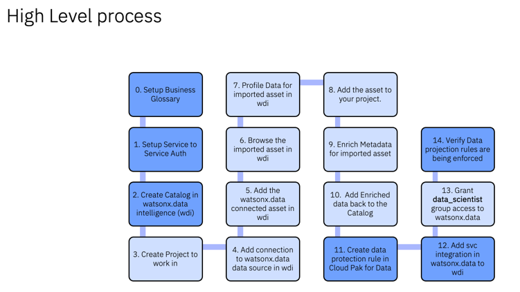

## 2. Prerequisites:
- Completed  [Environment Setup](env-setup/wealth-mgr-env-setup.md)
- Moderator prepared Bootcamp Catalog, imported business glossary and created data protection rules.
 

## 3. Configure Service to Service Integration

[Documentation link](https://dataplatform.cloud.ibm.com/docs/content/wsj/governance/wkc-wxd-integration.html?context=cpdaas&locale=en&audience=wdp)

Before you can start working with data protection rules on watsonx.data
assets, you must authorize the `watsonx.data` and `watsonx.data intelligence` services to access each other. For
ease of use, these authorizations for the bootcamp have been
pre-configured for you.

* To verify, in IBM Cloud, Go to `Manage` -> `Access IAM`, then from left menu `Authorizations`.
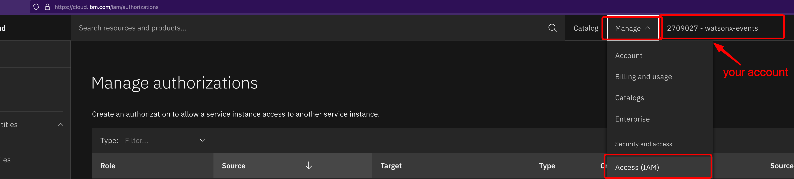

  You should find authorizations similar to below with your techzone instance

  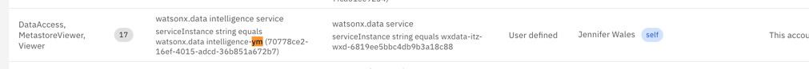

  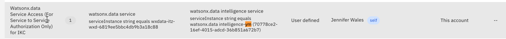

## 4. Create Catalog in watsonx.data Intelligence

The Catalog is the place where we will make watson.data connections and
data assets available to the business users.  

When creating a catalog it's required to enable the option to `Enforce data
protection and data location rules` if data protection rules will be used between the two services 

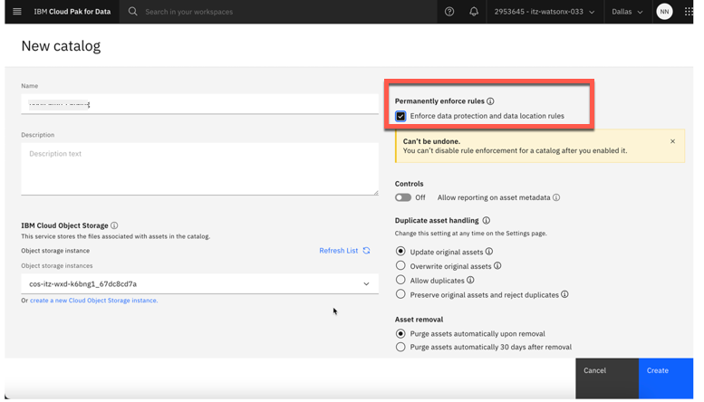 

For the bootcamp, the catalog has been created for you and will be shared by all students. For this reason, it’s important that the connections and assets that we add in the lab are uniquely named.  

We will do this by pre-pending `FirstInitial+Lastname` for content we add to the catalog.

## 5. Data Curation

Note:  The data curation process will also use a project like Lab 2, however this project will be created within the watsonx.data Intelligence Service instead of watsonx.ai Studio in order to leverage the data fabric capabilities of the service.

### 5.1 Open watsonx.data Intelligence service

* From IBM Cloud `Resource List` <https://cloud.ibm.com/resources>

* Select watsonx.data Intelligence for your region (Under AI/ Machine Learning) in `IBM Cloud Pak for Data`
  
  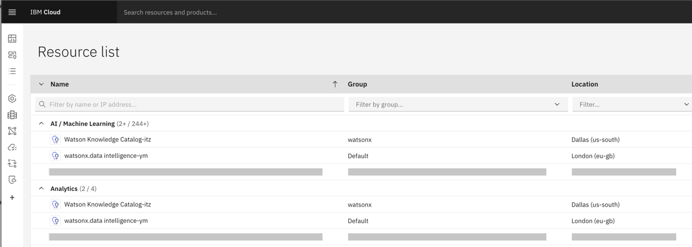

* Launch service
  
  

* Click `Cancel` if prompted with the get started window

### 5.2. Create a Project 

* From the Hamburger menu, select `Projects`, `View all Projects`

* Select `New Project`
* Name:  `Lab 3 Data Protection`
* Select your Cloud Object Storage from the list
* Select `Create`

## 6. Add a Connection to the watsonx.data Data Source
### 6.1 Copy watsonx.data connection info 

* From IBM Cloud `Resource list` <https://cloud.ibm.com/resources>

* Launch `watsonx.data` (Under `Databases`) (into a new window)

* From the Hamburger menu, select `Configurations`, `Connection information`

  

* Under Engine and service connection details

* Select your presto engine

* `Copy JSON snippet` (to clipboard)

  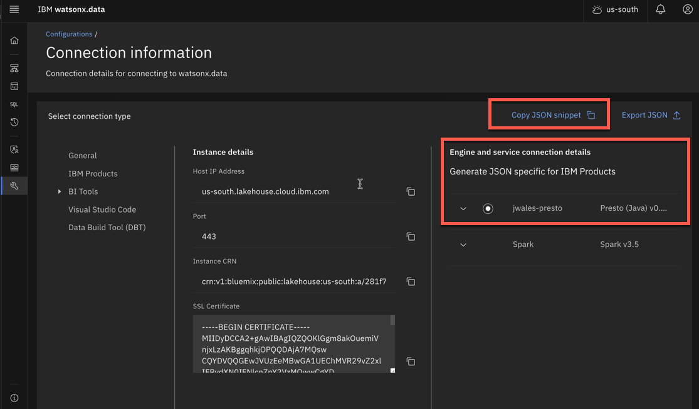  

* Paste to your text Reference notes (you will use this in the next step)

### 6.2 Open Bootcamp Catalog

* Go back to the `watsonx.data Intelligence` service.  
  
* From the Hamburger menu, select `Catalogs`, `View all Catalogs`
  
* Select the `Bootcamp Catalog`
  
### 6.3 Add a Connection to your watsonx.data Instance
  
* Select `Add to Catalog`, `Connection` in the right corner

* Search for and select `IBM watsonx.data` from left hand set of connectors

* Select `IBM watsonx.data Presto` and click Next

  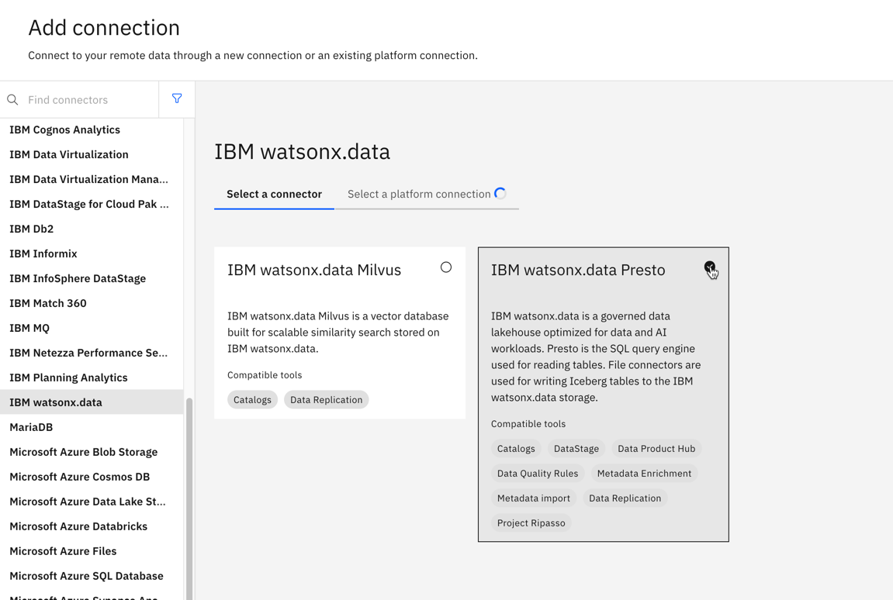 

* Select `Enter JSON snippet`

* Paste the watsonx.data connection info from your Reference note (that you copied earlier from watsonx.data Presto) and select `Enter`

  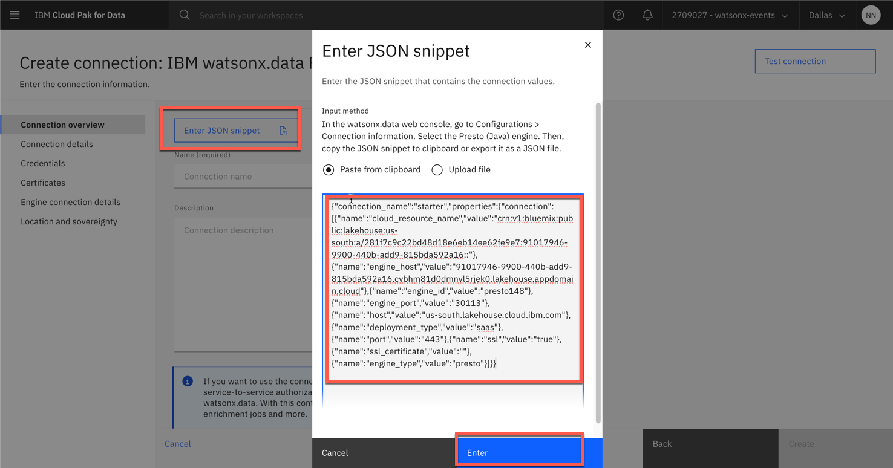

* Under Name, prepend with your **FirstInitialLastName**, ie `Jwales Presto`
* Scroll down and paste your `cloud-api-key` (created during the environment setup)

* Click `Test connection` (Upper right hand corner)

* When test is successful, select Create

  

##  7. Add the watsonx.data connected asset to the watsonx.data Intelligence Catalog

* From the left hand corner select `Add to catalog`, `Connected Asset`

  

* Click on `Select Source`

  

* Under available `Connections`, select [your Presto Connection], select `postgres_catalog`, select the `bankdemo` schema and finally the `customers_table` and click `Select`

  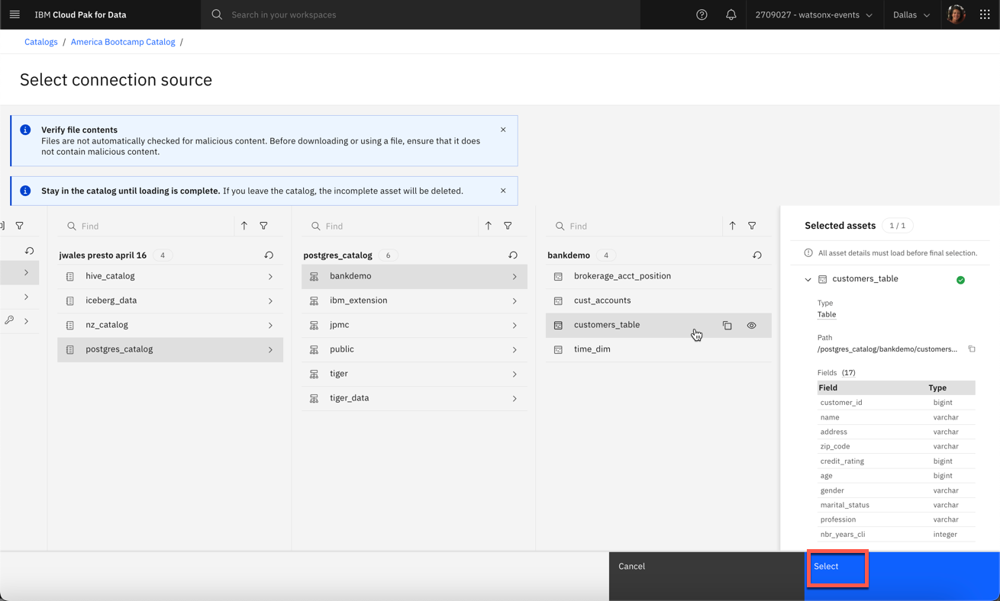 

* In the `Add asset from connection` window, prepend your name to the table name, for example: **jwales-customers-table**.  
* Leave the remaining fields as default and Click `Add`
  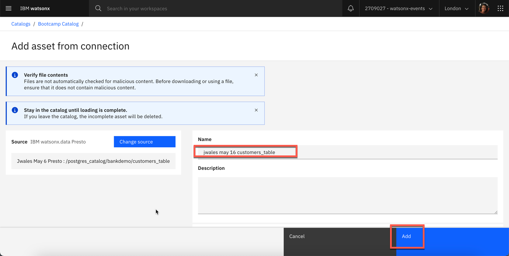 

* You should see your connection and data asset in `Recently added` Assets

  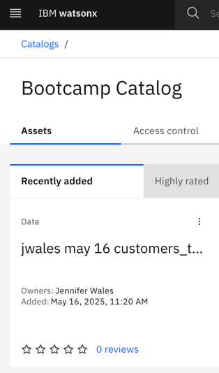 

##  8. Browse the imported Asset

* Select your Data Asset that you just imported
  
* Notice the table has no data quality, no business terms, no classifications.
  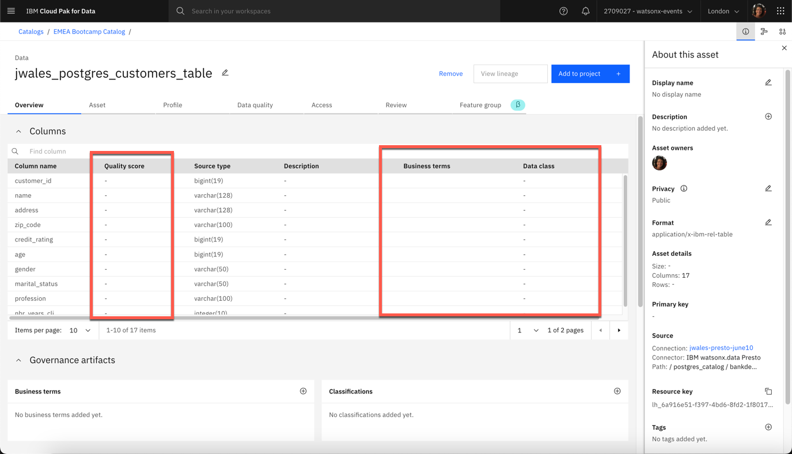 

* Select `Assets` tab and preview column info
* Here we see SSN and Email addresses that we will want to protect.
   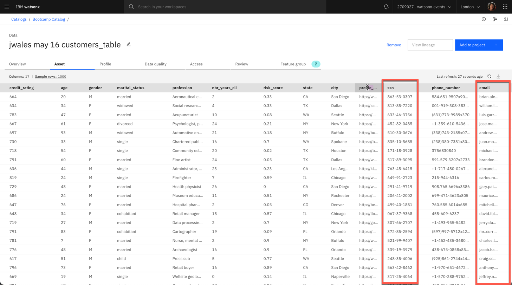 

##  9. Profile Data for Imported Asset

Profiling in Watsonx.data intelligence involves analyzing columns of data assets to understand their structure and content. This analysis includes computing statistics about the data, determining data types and formats, classifying the data, and capturing frequency distributions. 

* Select `Profile` tab to start profiling (takes 5-10 mins)

   

* When finished, Select option to `Add to project` 

  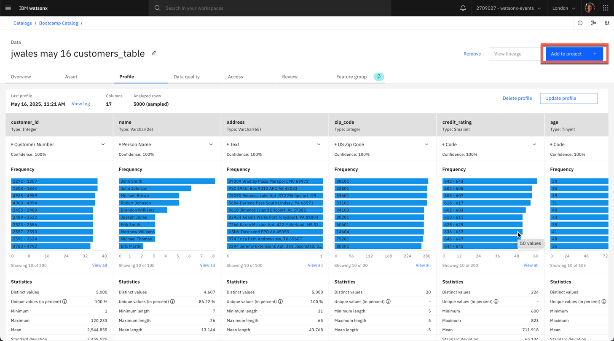 

* In the `Add to project` window, select `I Understand`, 
* Select the project you created in step 3  
* `Next` and then `Add`

   

**Note**  The preferred method of enriching a data asset would be to work directly in the project, performing a Metadata Import (MDI) followed by a Metadata Enrichment (MDE), then add to the Catalog.  Due to a bug with Profiling data after importing with MDI, we are taking the extra step of profiling in the catalog first.  This is a short term workaround until the issue is resolved. 

##  10. Enrich Data for Imported Asset

This step uses the automated Metadata enrichment tool to enrich the watsonx.data  asset that was just imported via the Catalog.

Metadata enrichment uses defined data classes and business terms to automatically assign or make suggestions during the metadata enrichment process. This saves organizations a tremendous amount of time and resources by alleviating the manual effort that would have been involved to accomplish the same result.

### 10.1 Set Enrichment Options

* Go to your project by selecting the Hamburger menu,  `Projects`, `View all Projects`, `Lab 3 Data Protection` 

  You should see 2 imported assets; your connection to watsonx.data and the imported table

  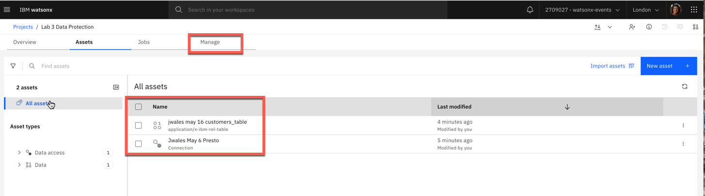 
  
* Set Enrichment Options by selecting `Manage`, `Metadata enrichment`, and scroll down to Term assignment methods and select: 
  
  * Machine learning (A machine learning model is used to assign terms.)
  * Data-class-based assignments (Terms are assigned based on the data class assignment for a column)
  * Name matching (Terms are assigned based on the similarity between a term and the name of the asset or column.)
  
  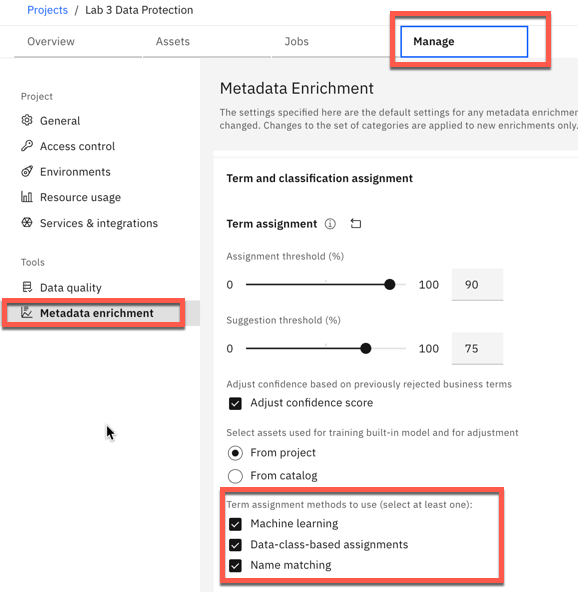 

    Gen AI based term assignment, (Semantic Enrichment) is an enrichment option available to a SaaS service with either a trial or Premium license.  With Gen AI based term assigment, domain-specific business terms are assigned and suggested by using the slate.30m.semantic-automation.c2c model. The model takes into account names and descriptions of assets and columns, and semantically matches terms with that metadata, assigning terms even if they aren't exact matches.  

    For the lab, we are using an essentials license, so Gen AI will not be used. 

### 10.2 Create Metadata Enrichment Job

* Switch back to the `Assets` Tab
* Select `New Asset`
* Select `Enrich data assets with metadata`
* Enter Name:  `MDE` and select `Next`
* Select `Select data from project` 
* Under Asset types, select `Data asset`, and `Your Table Name` and `Select`
   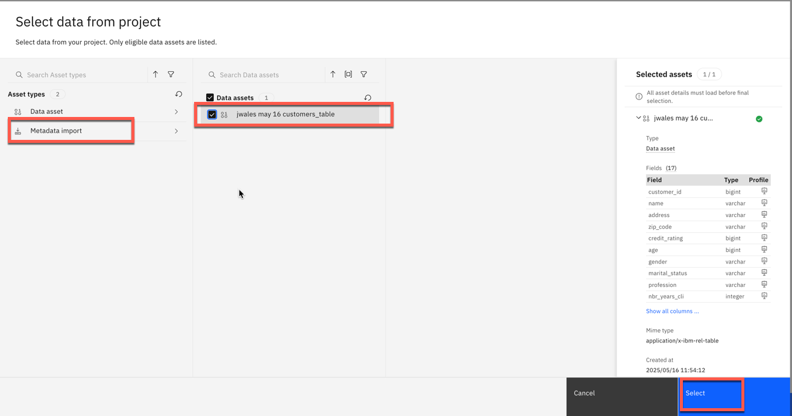 
* Your asset should be selected.  Select `Next`
* Set Enrichment Objectives by enabling the following options:
  * Profile Data
  * Assign terms and classifications
  * Run basic quality analysis  
  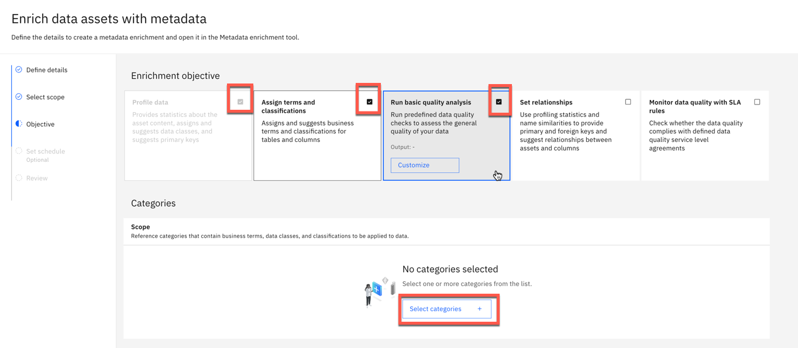 
  * Scroll down, Select  `Select categories + `
  * Select [uncategorized]  and `Customer` and `Select`
  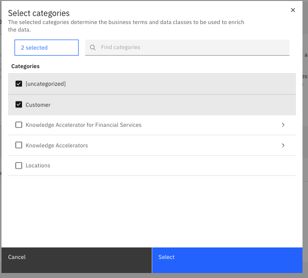 
* Keep defaults for Sampling, Schedule enrichment Job and click `Next`
  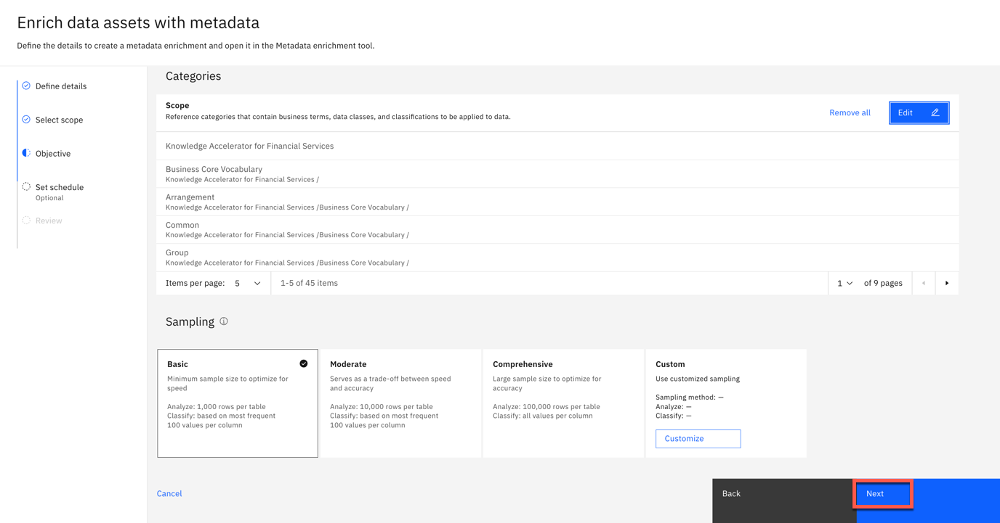 
* Keep defaults to run the job now and click `Next`
  
* Enrichment options will be displayed.  Select `Create` to start job
  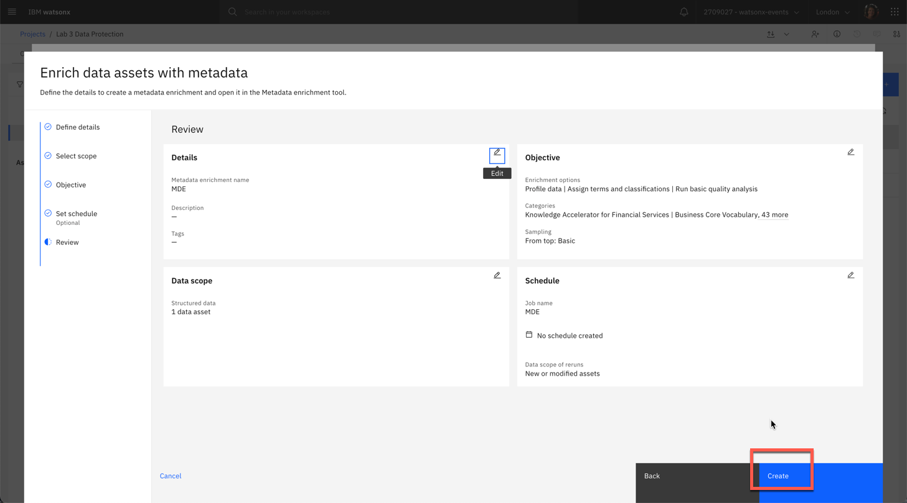 

The Data Scope will be analyzing one data asset imported from watsonx.data with an enrichment objective to Profile the data, analyze quality and assign terms across 2 categories using the Basic sampling method.

The enrichment process will take approximately 2-3 minutes to complete.  The status will change from `Not analyzed` to `In progress` to `Finished`.

### 10.3  Review Enrichment Results  

Based on the enrichment scope and objectives, the Metadata enrichment tool automatically profiled the data, analyzed and assessed data quality, assigned and suggested business terms, and assigned data classes to all columns for the data assets included in the metadata enrichment job.

As the data steward, you will now review the proposed enrichment before publishing to the catalog for others to consume.

* Select the `Refresh` button to show the metadata enrichment or optionally browse to it: Select the `Project-Name` , Select the `Assets` tab and select `MDE`

* Go to the Columns tab
  
  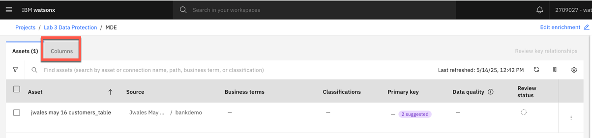 

The table now has metadata!  
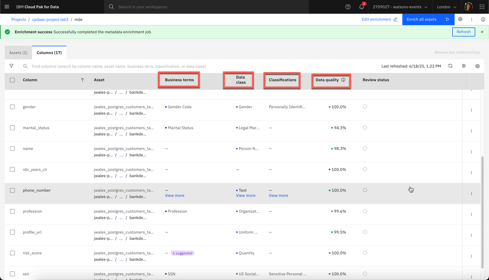 

Where watsonx.data intelligence met confidence thresholds, it automatically assigned business terms, data classes, and classifications.   

When the model fails to meet the enrichment threshold set, it will make a suggestion (in purple).  Let's explore

 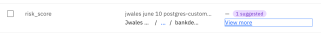 

* Click on the purple `1 suggested` bubble next to `risk_score`, then select the `Governance` tab on the right side and review the suggestion.
* Select the  `Assign` button to accept the suggestion.
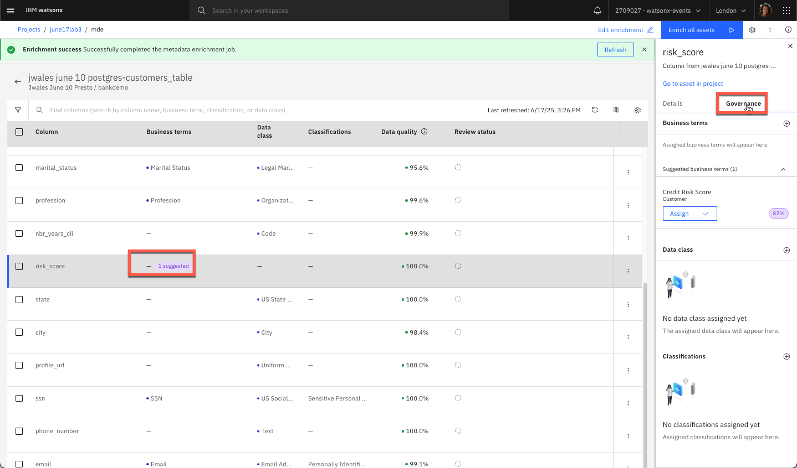 

In the case where there may be ambiguity in the business term, the model may not make a suggestion. 

* Hover over the business term column for `Address` and select `View more`  
* Select the `Governance` tab on the right side and select the `+` button
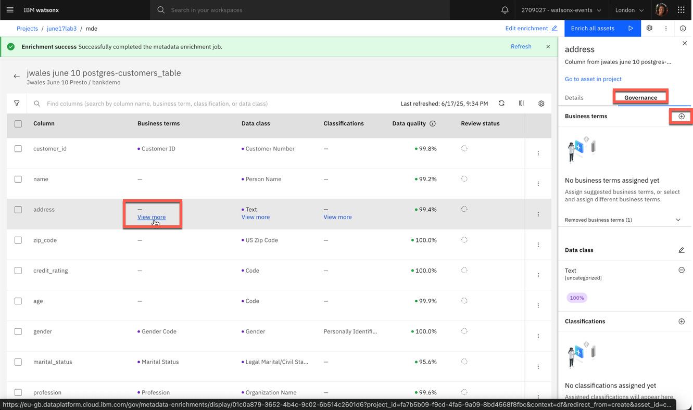 
* In the search bar, type `address`
* Select `Work Address` and `Assign`
 

Take a moment to explore the `Data Class` and `Classifications` metadata attributes that were assigned/suggested. 

A data steward would continue and assign values for all columns, but in the interest of time we are going to focus on what's needed to protect the data in the `SSN` and `Email Address` columns.

**Verify Data Classes** 

Data protection rules require a criteria for the rule to fire on and can include user attributes and data asset properties.   
For our lab, we are going to use the `Data class` attribute to classify the content in the columns to be protected. 

* On the `SSN` row, review the assigned `Data Class` and set it to `US Social Security Number` if it was not automatically assigned. 
* Optionally review and the `Classifications` and set to `Sensitive Personal Information`.

 
  
* On the `email` row, review the assigned `Data Class` and set it to `Email Address` if it was not automatically assigned. 
* Optionally review and the `Classifications` and set to ` Personally Identifiable Information`.  

When you are happy that your data is now properly identified and ready to be governed, you can add the enriched version back to the catalog

### 10.4  Add Enriched data back to the Catalog

* Navigate back to the asset view by clicking on the Asset tab

  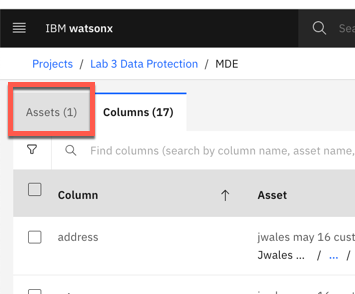 
* Select the checkbox next to the Data asset and click `Publish` in the blue bar
  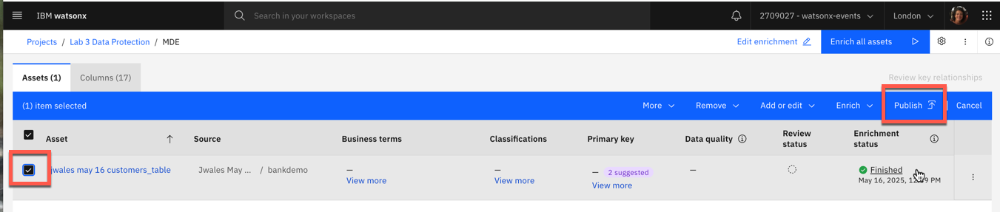 
* Select the `Bootcamp Catalog` and select `Next`
   
* On Review Assets Page, select `Publish`  
* This will take a few minutes and when finished you will see a message `Request to publish assets completed`
  
Before

    

After
  
  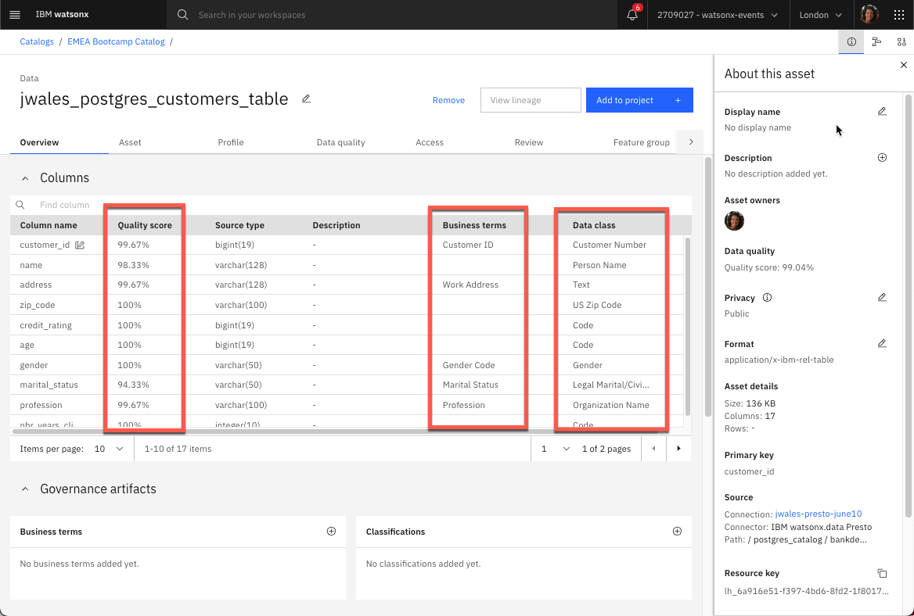 

## 11. Create Data Protection Rule in Cloud Pak for Data 

Now that Data has been curated, it's time to apply data protection rules.  For our use case, we want to protect Social Security numbers and email addresses from being viewable in the catalog.  

Because we are working in a shared watsonx.data Intelligence environment, this step has already been done for you.  Let's take a look at the rules that have been setup.

* Go to your `watsonx.data Intelligence` instance

* From the Hamburger menu, select `Governance`, `Rules`

  1. Preview the Protect US SSN and Email Rules

      For the lab, we’ve chosen to mask the SSN with the character X, and for the Email we will substitute data but could have also chosen to obfuscate or deny access instead.

       
       
     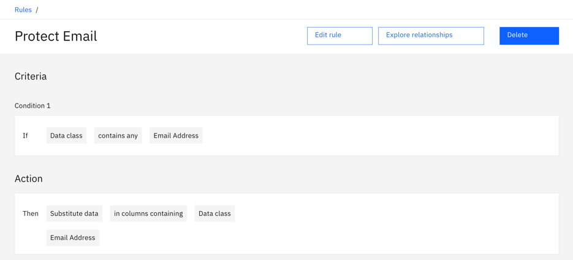 

##  12. Add Service Integration in watsonx.data to watsonx.data Intelligence

* Go to `watsonx.data` service instance

* From the Hamburger menu, select `Access Control`

* Select `Integrations` tab 
   

* Click `Integrate service +` button

* Select `IBM Knowledge Catalog`

* Under `Storage catalogs`, select all catalogs

* Add the watsonx.data Intelligence endpoint for your catalog by prepending api to your host:  
    https://api.dataplatform.cloud.ibm.com (for SaaS Dallas) 
    https://api.eu-gb.dataplatform.cloud.ibm.com (for London)

* Click `Integrate`

* :exclamation:Note: The service will not be activated by default.

* Click 3 dots to the right of the service integration and select `Activate`

   

* Click `Confirm` when prompted

* The integration will restart the presto engine.

   

## 13. Add restricted user access to watsonx.data

Data protection rules are enforced for users who are not administrators of the data resource.  For the lab, our business users will belong to the `Data_Scientist` user group.  

  
### 13.1 Add access to Infrastructure Components

* From the Hamburger menu, select `Access control` from `watsonx.data` 

* In `Infrastructure` Tab, Click `Add Access +`

* Select checkbox next to `Items` to select all and click Next

   

* Add data\_scientist, click Next

   

* Select the drop down and scroll to the right to select the appropriate roles for the restricted user group.
  * Select the `User` role for `Engines`
  * Select the `Reader` role for `storage` 
  * Select the `User` role for `catalogs`  you may have to scroll right to find them all
* Click Save

   

### 13.2 Add Policy to iceberg data

* Switch to the `Policies` Tab

   

* Click `Add Policy +`

* Name policy `postgres_allow`, and select `Policy status after creation` to `Active`, click Next

* Under Choose a resource to get started, Select all `postgres_catalog` 

* Under Search tables enable `all` box

* Click Next

* Click `Add rule +`

* Under Details select Allow -> select all actions

* On the right, under Choose users or groups, click `Add +`

* Select `Data_Scientist` Group and select Add

* Click `Add`, `Add`, `Review` and `Create`

## 14 Verify Data Protection Rule is being enforced (Demonstration)

* To demonstrate the data protection rule is being enforced, we must login to the environment with a user who is not an owner of the data.

* For the bootcamp, this is any user who has been added to the
Data\_Scientist group.

* :teacher to Demonstrate:

  * Login as restricted user

  * Go to `watsonx.data Intelligence` Instance

  * Open the `Bootcamp Catalog`

  * Open Data Asset from watsonx.data

  * Click `Asset` tab

    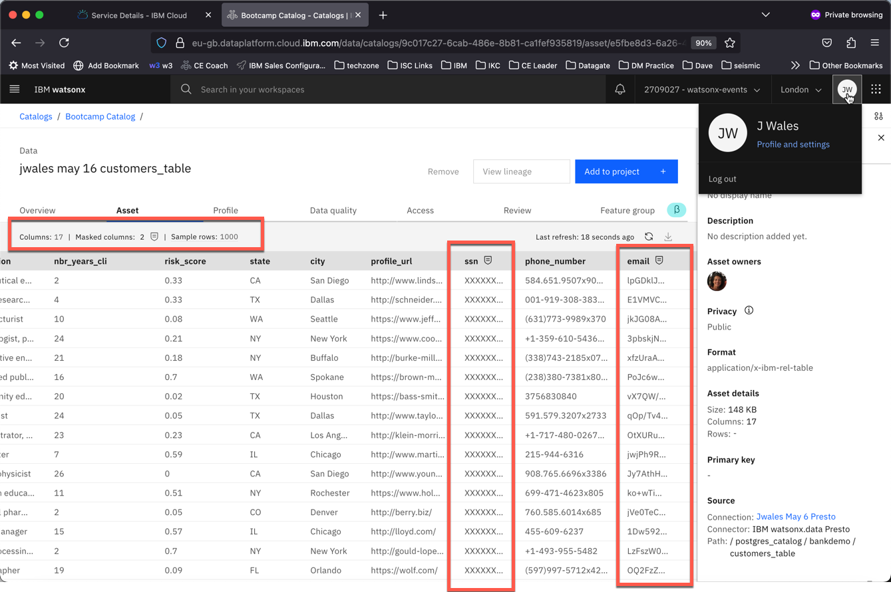 

  * In another window, go to `watsonx.data` instance

  * Go to `Query Workspace`

  * Navigate to iceberg table and generate Select Statement and select to
  Run on Presto engine

     

  * Scroll over to SSN column to view masking in place:

     

In this lab you have demonstrated that watsonx.data allows data stewards to enrich and catalog data just like any other data in their enterprise.

Finished!
