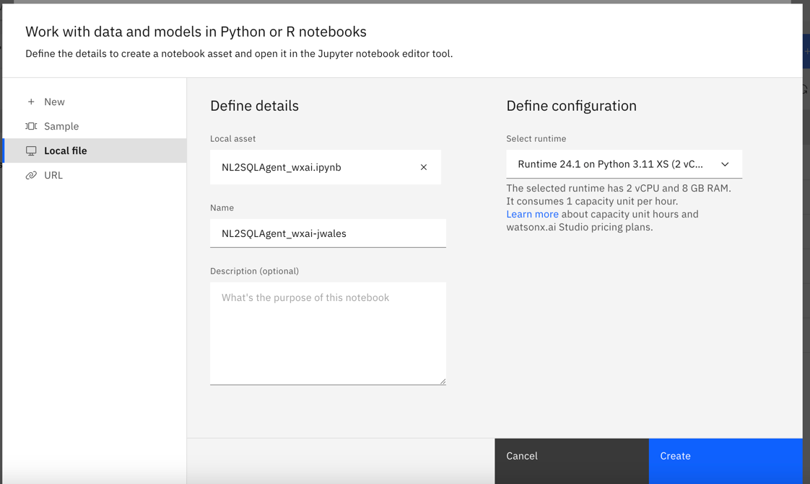
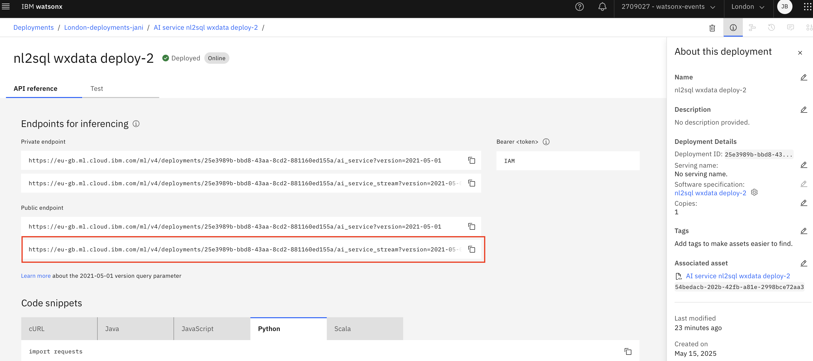
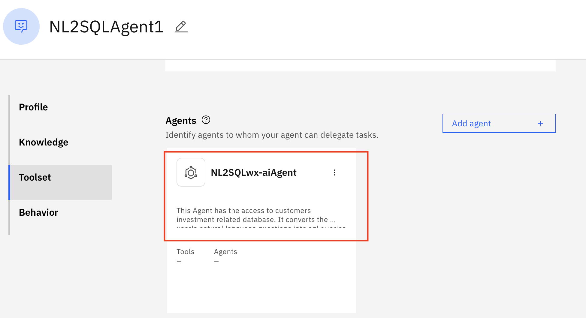
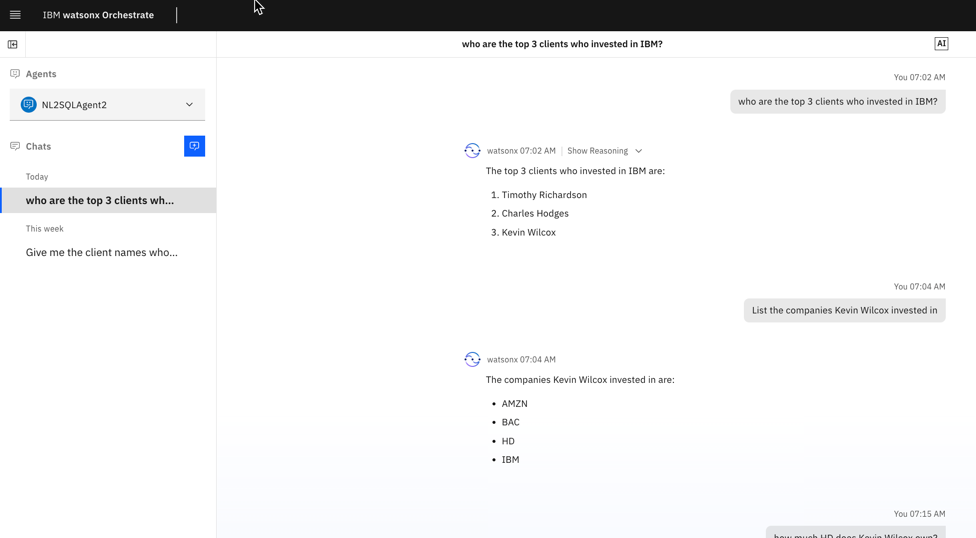

# Natural Language to SQL Agent

**Tabla de contenidos**
- [Natural Language to SQL Agent](#natural-language-to-sql-agent)
  - [1. Introducción](#1-introducción)
  - [2.  Prerrequisitos](#2--prerrequisitos)
  - [3. Crear y desplegar el agente NL2SQL](#3-crear-y-desplegar-el-agente-nl2sql)
    - [3.1. Abrir el proyecto watsonx.ai](#31-abrir-el-proyecto-watsonxai)
    - [3.2 Importar el Jupyter Notebook con el script desde la carpeta local](#32-importar-el-jupyter-notebook-con-el-script-desde-la-carpeta-local)
    - [3.3 Abrir y ejecutar el Jupyter Notebook](#33-abrir-y-ejecutar-el-jupyter-notebook)
  - [4. Integrar el agente en watsonx Orchestrate](#4-integrar-el-agente-en-watsonx-orchestrate)
    - [4.1 Obtener el endpoint del agente](#41-obtener-el-endpoint-del-agente)
    - [4.2 Crear un agente en orchestrate](#42-crear-un-agente-en-orchestrate)
    - [4.3 Desplegar el agente](#43-desplegar-el-agente)
    - [4.4 Probar el agente desplegado](#44-probar-el-agente-desplegado)


## 1. Introducción 
En este lab crearemos un agente que puede convertir consultas en lenguaje natural de los usuarios a consultas SQL y usar el motor presto para consultar los datos y responder al usuario con la respuesta. 

Este lab usa la `customers_table` del postgres_catalog y las tablas `accounts_table` y `holdings table` del catálogo iceberg_data como fuentes de datos.

## 2.  Prerrequisitos
- Haber completado la [configuración de ambiente](/env-setup/README.md) 
- Haber completado los Labs 1 y 2
  
## 3. Crear y desplegar el agente NL2SQL

### 3.1. Abrir el proyecto watsonx.ai
1. Abre el servicio de watsonx.ai Studio: en la [Cloud Resource list](https://cloud.ibm.com/resources) selecciona los recursos de `AI / Machine Learning` -> servicio `watsonx.ai Studio` -> abrir en `IBM watsonx`
<br>
2. Inicia sesión y desde la página de acceso rápido -> `Recent work` selecciona el proyecto que creaste durante la [configuración de ambiente](..//env-setup/README.md).

3. Verifica que puedas ver el archivo env.txt en la lista de todos los assets en la pestaña `Assets`

4. Verifica que las conexiones estén disponibles; las usaremos en el lab


### 3.2 Importar el Jupyter Notebook con el script desde la carpeta local

1. Ve a los Assets del proyecto y selecciona `New asset +`:
  [new-asset](attachments/2025-06-11-13-32-03-pasted-vscode.png)

2. Selecciona el tipo de asset `Work with data and models in Python or R notebooks`


3. Importa el Jupyter Notebook desde un archivo local:
   * Selecciona Local File
   * Haz clic en Browse
   * Navega y selecciona [NL2SQLAgent_wxai.ipynb](NL2SQLAgent_wxai.ipynb)
    * Agrega al nombre tus iniciales: `-name-first3lettersSurname` y haz clic en `Create`
  

### 3.3 Abrir y ejecutar el Jupyter Notebook

1. Debería abrirse automáticamente justo después de crearlo; si no, ve a `Your Project` -> `Assets`:
    * haz clic en el Jupyter Notebook
    * y luego haz clic en el lápiz para editar; se abrirá el Jupyter Notebook en modo edición
     

2. Márcalo como confiable en la esquina superior derecha:
  
3. Agrega un Project Token para acceder a los assets del proyecto

     * Haz clic en la segunda celda con imports para activarla
     * Inserta una celda debajo haciendo clic en el signo `+`
    
     * En el menú superior selecciona los 3 puntos para insertar el snippet de project token:
    
     * Ahora debería verse así (el orden es importante):
    
4. Ejecuta todas las celdas consecutivamente comenzando por la instalación de paquetes en la primera celda y revisa las salidas

## 4. Integrar el agente en watsonx Orchestrate

### 4.1 Obtener el endpoint del agente
1. Ya deberías estar en watsonx.ai Studio. Si no:
   * Abre `watsonx.ai Studio` desde cloud resources:  https://cloud.ibm.com/resources
   * Ábrelo en `IBM watsonx.ai`
2. Desde el menú hamburguesa, ve a `Deployments`, `View all deployment spaces`
3. Abre tu deployment space
4. Ve a la pestaña `Assets`
5. Haz clic en el AI Service `AI service nl2sql wxdata deploy xxxx` para abrir el asset.
6. Haz clic en el deployment `AI service nl2sql wxdata deploy xxxx` para encontrar los Endpoints de inferencia
7.  En Public Endpoint, copia el endpoint del agente que incluya `ai_service_stream` como se muestra a continuación y pégalo en tu nota de referencia. Lo usarás en el siguiente paso.


### 4.2 Crear un agente en orchestrate
1. Abre `watsonx orchestrate` desde cloud resources:  https://cloud.ibm.com/resources
2. Desde el menú hamburguesa, ve a `Build`, `Agent Builder`


3. Selecciona el botón `Create Agent +` 

   * Selecciona `Create from Scratch`
   * Nombra el agente `NL2SQLAgent <Your Initials>`
   * En Description ingresa `This agent helps to answer user's queries by converting natural language questions into SQL.`
   * Selecciona el botón `Create` para crear el agente
   
4.  Configura los detalles del agente.
    * Desplázate hasta la sección `Toolset` en el lado izquierdo
    * Haz clic en `Add agent` bajo Agents
    
    * Selecciona la opción `Import` en el popup de agregar nuevo agente.
    
    * Selecciona `External agent` y haz clic en `Next`.
    
5.  Configura las opciones de importación del agente 
    * Elige `watsonx.ai` como provider ya que nuestro agente NL2SQL está desplegado en la plataforma watsonx.ai
    * Agrega tu `Cloud API Key` desde tu nota de referencia en `API Key`
    * En `Service instance URL` pega el deployment endpoint que copiaste anteriormente
    * En `Display Name` agrega `NL2SQLwx-aiAgent-<Your initials>`
    * En `Description of agent capabilities` agrega:
    ```
    This agent has access to customer's investment related data.  It converts the user's natural language questions into sql queries to fetch the data from the database and respond to the user.
    ```
    * Selecciona `Import Agent` para integrar el agente de watsonx.ai.
  

  El agente importado ahora debería aparecer en la sección agents.
  

### 4.3 Desplegar el agente
1.  En la sección `Preview`, ingresa un saludo para iniciar un chat desde la ventana de chat del lado derecho.
2.  Ingresa la pregunta:
```
Who are the clients who have invested in IBM and are holding more than 10000.  Give me just 5 such clients and their respective investment amounts.
```  
3. Haz clic en el botón `Deploy` en la esquina superior derecha y luego en `Deploy` para desplegar el agente.

### 4.4 Probar el agente desplegado
1. En el menú hamburguesa, ve a `Chat` y selecciona tu agente desplegado en el desplegable `Agents` 
2. Interactúa con el agente haciendo diferentes variaciones de preguntas
  * `Who are the top 10 clients invested in Amazon and what their holdings are`
  * `Who are the top 3 clients invested in IBM`
  * `List the companies Kevin Wilcox has invested in`
  
  
1. Evalúa las respuestas y el razonamiento.  
   * Haz clic en `Show Reasoning`, luego en `Step 1` para ver la lógica y las consultas SQL creadas a partir del lenguaje natural
   

   Estas consultas acceden a información de múltiples sistemas backend y usamos el watsonx.data Lakehouse para unirlos. El agente primero analiza la pregunta y entiende qué tablas se deben acceder o unir. Luego genera una consulta SQL ejecutable que se envía a watsonx.data y el resultado se entrega al wealth manager de forma conveniente sin tener que ir a múltiples sistemas.  
