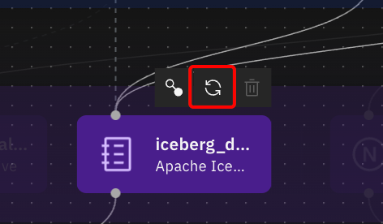
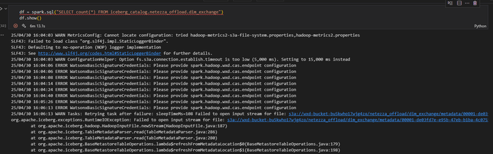
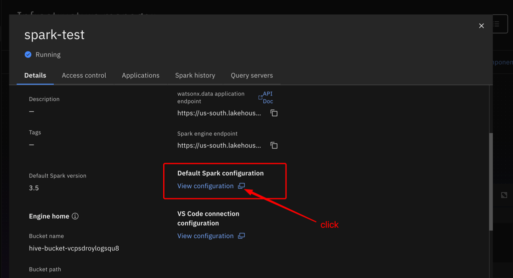
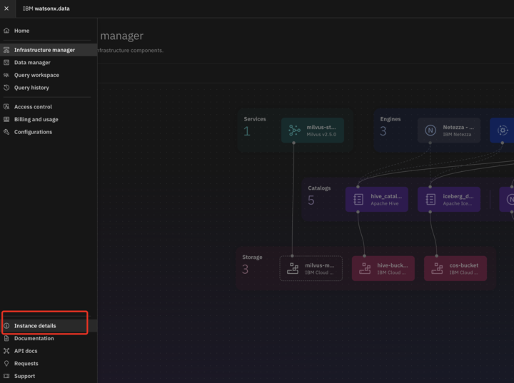
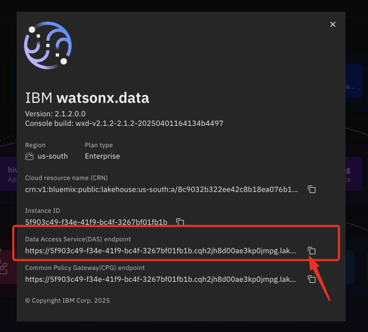
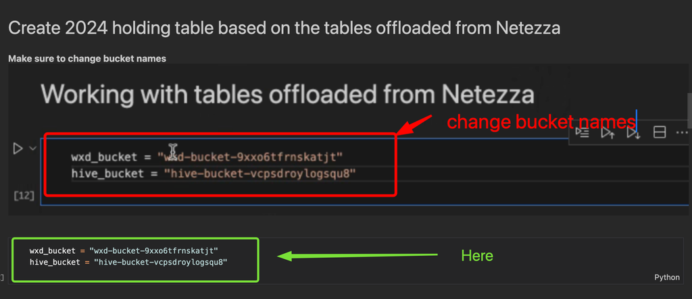
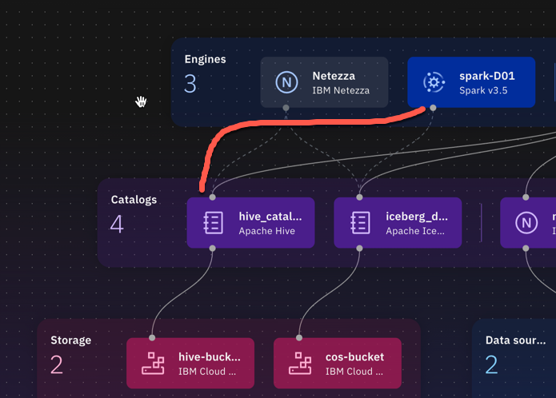
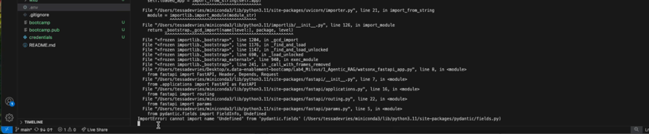
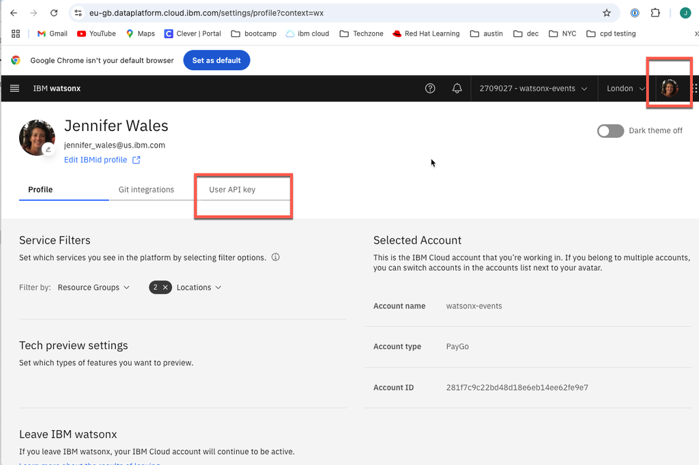

# Troubleshooting tips

**Table of contents**
- [Troubleshooting tips](#troubleshooting-tips)
  - [1. Environment Setup](#1-environment-setup)
    - [1.1 Provisioning of wxd stuck initializing 4:10 remaining](#11-provisioning-of-wxd-stuck-initializing-410-remaining)
    - [1.2 Students did not receive techzone invitation](#12-students-did-not-receive-techzone-invitation)
    - [1.3 Student seeing all of the wxd instances](#13-student-seeing-all-of-the-wxd-instances)
    - [1.4 Configuring watsonx.ai project not able to find Watsonx machine learning service](#14-configuringwatsonxaiproject-not-able-to-find-watsonx-machine-learning-service)
    - [1.5 Creating COS Connection  `Select instance` didn't detect a COS instance, follow the instructions below to manually create the COS connection.](#15-creating-cos-connection--select-instance-didnt-detect-a-cos-instance-follow-the-instructions-below-to-manually-create-the-cos-connection)
  - [2. Lab 1 - Netezza](#2-lab-1---netezza)
    - [2.1 Create schema errors:](#21-create-schema-errors)
  - [3. Lab 2 - Presto and Spark](#3-lab-2---presto-and-spark)
    - [3.1 Failures running `1_add_data_presto.ipynb`](#31-failures-running-1_add_data_prestoipynb)
    - [3.2 Environmental variables errors](#32-environmental-variables-errors)
    - [3.3 Read Timed out during running add\_data\_presto Notebook](#33-read-timed-out-during-running-add_data_presto-notebook)
    - [3.4 Error in inserting data in a table (looks like some issue with creating tables / metadata)](#34-error-in-inserting-data-in-a-table-looks-like-some-issue-with-creating-tables--metadata)
    - [3.5 Spark errors](#35-spark-errors)
  - [4. Lab 4 - RAG Agent](#4-lab-4---rag-agent)
    - [4.1 Failures running `1_add_data_milvus_collection.ipynb`](#41-failures-running-1_add_data_milvus_collectionipynb)
    - [4.2 Other parts of the lab: WxO, uvicorn and Code Engine](#42-other-parts-of-the-lab-wxo-uvicorn-and-code-engine)
  - [5. Lab 5 NL2SQL Agent and Orchestrate](#5-lab-5-nl2sql-agent-and-orchestrate)
    - [5.1 Deployment creation failed Task credentials are required](#51-deployment-creation-failed-task-credentials-are-required)
    - [5.2 How do I find my Namespace in Code Engine?](#52-how-do-i-find-my-namespace-in-code-engine)


## 1. Environment Setup

### 1.1 Provisioning of wxd stuck initializing 4:10 remaining  
:wrench: **Solution**:  Need assistance from SRE team, check [Slack channel](https://ibm.enterprise.slack.com/archives/C0789PYP9B2)

### 1.2 Students did not receive techzone invitation
In Toronto data center, inviting users via Techzone UI works intermittently.  If students never receive invitation, manually invite them via IBM Cloud.  
- Login to IBM Cloud, go to `Manage`, `Access (IAM)`, `Users`
- Click button to `Invite Users`
- Paste email addresses (one per line)
- Select Admin group for techzone instance, should start with `itz`
- Click `Add`, then `Invite`

### 1.3 Student seeing all of the wxd instances  
:wrench: **Workaround**:  use your Cloud Service ID as a filter to see your own

### 1.4 Configuring watsonx.ai project not able to find Watsonx machine learning service  
:wrench: **Solution**:  wml service renamed watsonx.ai Runtime

### 1.5 Creating COS Connection  `Select instance` didn't detect a COS instance, follow the instructions below to manually create the COS connection.


* Enter connection name

* Leave `Bucket` name field empty


* fill in `Login URL` with COS Bucket Public Endpoint without `https://`

You can find COS Public Endpoint from IBM Cloud [Resource list](https://cloud.ibm.com/resources)-> Select and click on `cos instance` -> `Buckets` tab -> Select one of the buckets created, e.g. `hive` bucket -> Go to `Configurations`


Copy public endpoint


* For credentials select `Resource instance ID and API key`

* To get `Resource instance ID` and `API key` you need to go back to COS service instance -> click back to instance from the bucket 


And copy values to watsonx.ai Connection:
* `Resource instance ID`: `resource_instance_id`
* `API key`: `apikey`

Now test connection and if successful, click `Create`.


## 2. Lab 1 - Netezza

### 2.1 Create schema errors: 

* :white_check_mark: check that you have the correct bucket name in location specification

* :white_check_mark: check in COS and watsonx.data UI Data manager whether schema was created and available => despite error all might work as expected

* :arrows_counterclockwise: sync metadata and try again

    From Infrastructure manager → hover over iceberg data catalog → Sync all objects (might not work from the first time)

    


    Then check COS and watsonx.data UI Data manager again

    If schema is not created, run SQL Query again

* :wrench: add new COS bucket and Presto engine

* :x: might be overall instance error → instance services didn’t generate properly

## 3. Lab 2 - Presto and Spark

### 3.1 Failures running `1_add_data_presto.ipynb`

### 3.2 Environmental variables errors

  * :white_check_mark: Insert `print` statements on some of environmental variables to verify variables are being set as expected
  * :white_check_mark: Verify student is using provided env file with filled in environmental variables that has correct name and location as specified in `load_dotenv`
  * :white_check_mark: Restart kernel after updating env file
  * :white_check_mark: Confirm Contents of Env file
  * :white_check_mark: COS Endpoint prefaced by https://
  * :white_check_mark: COS API key should not be cloud API key
  * :white_check_mark: Variables with special characters in double quotes

### 3.3 Read Timed out during running add_data_presto Notebook  
:repeat: **Solution**:  re-run recreate tables in notebook

### 3.4 Error in inserting data in a table (looks like some issue with creating tables / metadata)  
:repeat: **Solution**:  re-run recreate tables in notebook, or rerun the whole Jupyter Notebook

### 3.5 Spark errors
Missing Spark configuration in EU GB environment for some instances (even in default configuration of spark engine)

    Error output: in our case spark.hadoop.wxd.cas.endpoint was missing
    
    Checked the default spark configuration via watsonx.data UI (Infrastructure manager → click on spark engine) → Default spark configuration
    
    :wrench: **Solution**:  
    * Create a new spark cluster (old one might not work properly)
    * Manually add configuration when initializing pyspark session → I’ve checked how this configuration should be setup for working watsonx.data instance (my own) and added it to spark session 
    * :warning:spark.hadoop.wxd.cas.endpoint is different for each .data instance
    `https://<your DAS>/cas/v1/signature`, see where to find DAS below

    How to add a configuration manually to your spark instance
    ```python
    def init_spark():

        """

        Initialize spark instance -> here you don't need any credentials for wx.data 2.1.0, the configuration is setup for the cluster / unless you want to connect external sources

        """

        spark = SparkSession.builder \
            .config("spark.hadoop.wxd.cas.endpoint", "https://c9c70bf0-ea2a-4751-883a-d2a7c8555a4c.cle3a4nl02ifri83sam0.lakehouse.appdomain.cloud:30793/cas/v1/signature") \
            .appName("spark-demo") \
            .enableHiveSupport() \
            .getOrCreate()

        return spark
    ```
    How to find your DAS:
    

    

    [](attachments/2025-05-28-18-30-45-pasted-vscode.png)

* Error loading json file  
:wrench: **Solution**: update bucket names in Jupyter Notebook cells to yours


* `spark_processing.ipynb` failing to load tax liability json -> Problem was caused by Spark engine not being associated with hive_catalog:  
:wrench: Solution:  
  * Associate catalog, restart spark engine in wxd.
  * Delete spark cluster in vscode and recreate, then rerun.



## 4. Lab 4 - RAG Agent

### 4.1 Failures running `1_add_data_milvus_collection.ipynb`

* Overall checks
  * :white_check_mark: Insert PRINT statements to verify variables are being set as expected
  * :white_check_mark: Confirm .env file in root of Lab 4 and confirm contents:  
    * Milvus Host should not include Port on end
    * Variables with special characters in double quotes
  * :white_check_mark: Confirm student included data folder when adding files to  COS Bucket  and did not just select single PDF and upload.  

* Host can be a string error running `1_add_data_milvus_collection.ipynb` -> Problem was due to milvus host including port on end.  
  :wrench: **Solution**:  Modify host to remove port, save env and restart Kernel

### 4.2 Other parts of the lab: WxO, uvicorn and Code Engine
* Do not see AI Agent Configuration option in WxO  
:wrench: **Solution**: switch from Legacy Chat to AI Chat experience.  Click on username in upper right hand corner, Select Settings, Select Chat Version Tab, Switch to AI Chat

* Import error: `cannot import name undefined from pydantic.fields`

    Problem was related to conda env.  
    :wrench: **Solution**: 

    * recreate python virtual environment
    * deactivate conda and activate venv
    ```
    conda deactive
    source venv/bin/activate
    ```
    * load requirements (also had to remove version of torch)

    * re-run `uvicorn watsonx_fastapi_app:app --host 0.0.0.0 --port 8080 --reload`

* uvicorn import libraries error → uvicorn doesn’t use the predefined environment  
:wrench: **Solution**:
* make sure that in console you have the correct python venv activated
* you can run uvicorn from this environment directly:
  * create venv in Lab4_Milvus/1_Agentic_RAG
  * install there requirements
  * copy .env there
  * go to  Lab4_Milvus/1_Agentic_RAG and run ./venv/bin/uvicorn watsonx_fastapi_app:app --host 0.0.0.0 --port 8080 --reload

Steps to create individual repo in section 3.1 are not necessary.  The Agent can be deployed to Code Engine directly from the https://github.ibm.com/shansund/x.data-enablement-bootcamp repo with the context directory set to Lab4_Milvus/1_Agentic_RAG. The personal ssh key is associated with the user and works to give access to anything the user has access to.

## 5. Lab 5 NL2SQL Agent and Orchestrate

### 5.1 Deployment creation failed Task credentials are required


:wrench: **Solution**:  Make sure watsonx.ai  API key has been generated.   Click on your picture in upper right hand corner, Profile and Settings, Select User API Key and generate if one does not exist.  You do not need to capture it; but it must exist for the notebook to run.

* Section 6.2 of Lab 5  if you don't see AI Agent Configuration in the hamburger menu: -→ add this set of instructions before users are told to go to the AI Agent configuration section.  
:wrench: **Solution**:
  * Go to settings (from profile in right upper corner)
  * Then "chat version" tab
  * then switch to AI chat
  * Go back to home page for wxO and you should then see it in the hamburger menu.

### 5.2 How do I find my Namespace in Code Engine?
:thinking: **Solution**: In Code Engine, go to Containers, Container Registry, Namespaces and paste your Cloud Service ID in the filter.  If you cannot find your namespace, you are likely not in the correct Code Engine Instance.  Go back to your resources and paste the same Cloud Service ID in the group filter to find.
