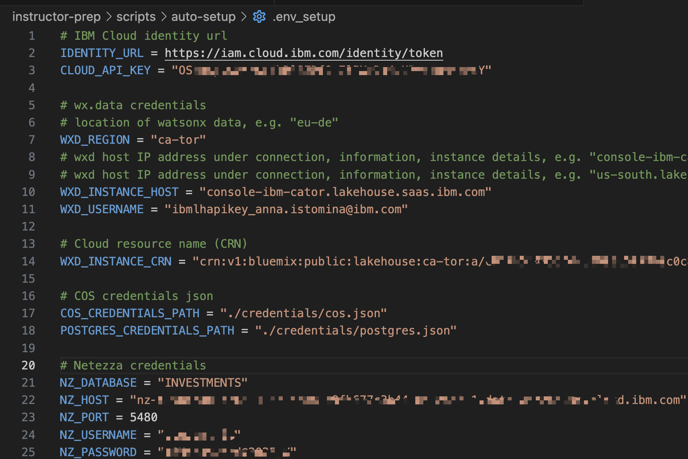
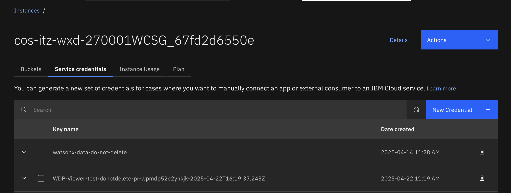
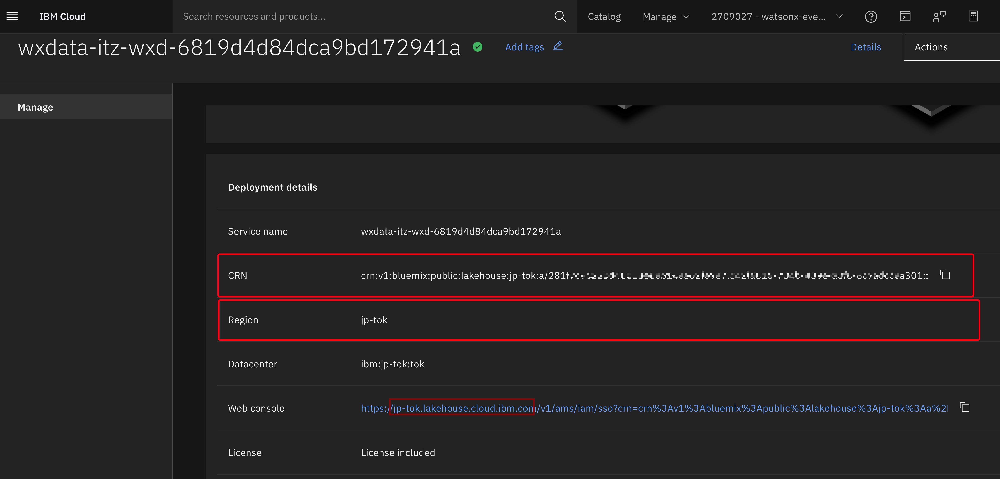
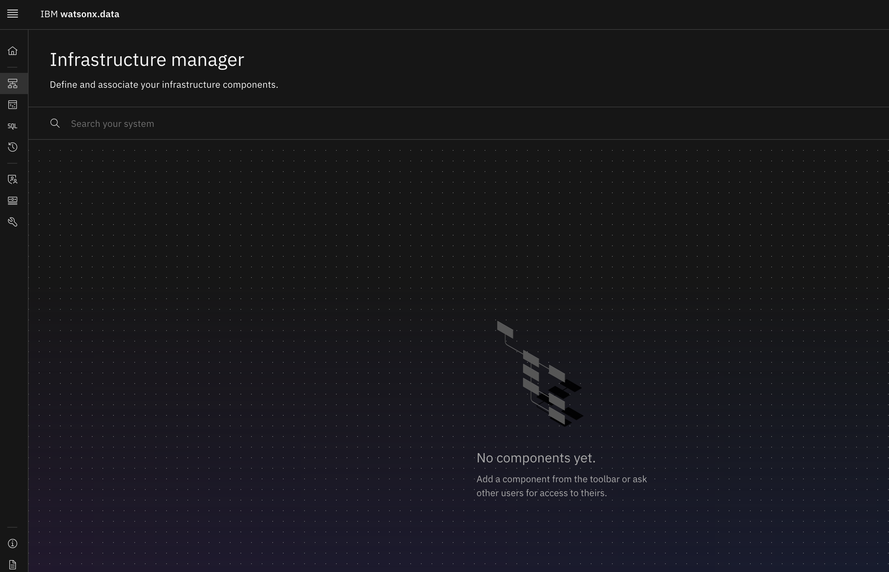

#  IBM watsonx.data Env. Setup (automated)

**Technical Hands-on Lab: Provision Environment**

- [IBM watsonx.data Env. Setup (automated)](#ibm-watsonxdata-env-setup-automated)
- [1. Getting Started](#1-getting-started)
  - [1.1 Open bootcamp main directory in VSCode or clone the repo if not yet](#11-open-bootcamp-main-directory-in-vscode-or-clone-the-repo-if-not-yet)
  - [1.2 Make sure you have correct remote repo](#12-make-sure-you-have-correct-remote-repo)
  - [1.3 Pull the latest changes](#13-pull-the-latest-changes)
  - [1.4 Login to your new Techzone environment](#14-login-to-your-new-techzone-environment)
  - [1.5 Verify you are in the right instance.](#15-verify-you-are-in-the-right-instance)
- [2. Credentials and configurations](#2-credentials-and-configurations)
  - [2.1 Create an API key](#21-create-an-api-key)
  - [2.2 Create COS Service Credentials](#22-create-cos-service-credentials)
  - [2.3 Add watsonx.data configuration to env file](#23-add-watsonxdata-configuration-to-env-file)
  - [2.4 Copy Postgres credentials](#24-copy-postgres-credentials)
  - [2.5 Copy Netezza credentials](#25-copy-netezza-credentials)
- [3. watsonx.data Instance initial setup (15-30 mins)](#3-watsonxdata-instance-initial-setup-15-30-mins)
  - [3.1 Prepare python environment](#31-prepare-python-environment)
  - [3.2 Execute quick setup script](#32-execute-quick-setup-script)
- [4 Run Auto setup script in Jupyter Notebook](#4-run-auto-setup-script-in-jupyter-notebook)
- [5 Verify](#5-verify)
- [6 Return to instructions](#6-return-to-instructions)


# 1. Getting Started

## 1.1 Open bootcamp main directory in VSCode or clone the repo if not yet
* VSCode -> Open Folder -> select `watsonx.data-client-bootcamp-2025 `
  
* Or if you need to clone the github repo
```sh
git clone git@github.ibm.com:skol/watsonx.data-client-bootcamp-2025 .git
```
## 1.2 Make sure you have correct remote repo

```sh
git remote -v 
```


## 1.3 Pull the latest changes

```sh
git pull
```

## 1.4 Login to your new Techzone environment 
:warning: As a prerequisite you should have a new instance of watsonx.data provisioned

* Go to: <https://cloud.ibm.com/resources>

* Login with your IBM credentials

You can reserve a new Techzone environment here [collection link](https://techzone.ibm.com/collection/67d1edfa2aa18c25d43edb04).


## 1.5 Verify you are in the right instance. 

Check at the top right that you are in the right instance –
**watsonx-events** or **watsonx-events2**


If it does not show the right name of the instance, you can select it from the drop-down.

<font color="red">**CAUTION:**</font>  The instance at the top right tends to change to your default personal account every time you switch/go back to a new page. Thus, it's always good to check the top right corner **every time** you switch to a new page.
  

# 2. Credentials and configurations

* Within `instructor-prep/scripts/auto-setup` folder create a subfolder `credentials` with 2 empty json files: `cos.json` and `postgres.json`. At later steps you will store there credentials for Cloud Object Storage `cos.json` and for Postgres database `postgres.json`.

* Create env file in `instructor-prep/scripts/auto-setup` folder: copy `instructor-prep/scripts/auto-setup/env_setup.example` as `instructor-prep/scripts/auto-setup/.env_setup` where you will during the next steps fill values for:
  * `CLOUD_API_KEY`
  * `WXD_REGION`
  * `WXD_INSTANCE_HOST` # be aware of a different syntax for Toronto DC
  * `WXD_USERNAME`
  * `WXD_INSTANCE_CRN`  



## 2.1 Create an API key

From the IBM Cloud interface use to the top menu

* Manage -> Access IAM 
* From the Left Navigation click Manage Identities -> API Keys
* Click on the Create button
* Copy the key to `instructor-prep/scripts/auto-setup/.env_setup` as a value for `CLOUD_API_KEY`

:warning: In case you create or re-create intial bucket manually for some reason, make sure to create **a regional bucket in the same location as watsonx.data** -> because location for COS instance is generated based on your region input for env file.

## 2.2 Create COS Service Credentials

From you storage interface, go to your COS Instance, and go to the `Service Credentials` tab.



* Select `+ New Credential`

* Uncheck `Control by Secrets Manager` as it's not provided within the instance

* Name: `cos_credentials`

* Role: `Manager`

* Enable option for `HMAC Credentials`


* Select the twistie to show your credentials

* Copy and paste the credentials  in `instructor-prep/scripts/auto-setup/credentials/cos.json`


## 2.3 Add watsonx.data configuration to env file

Go to IBM Cloud `Resource List`, click on watsonx.data instance in the databases, scroll down and copy values in `instructor-prep/scripts/auto-setup/.env_setup`:
* `CRN` as `WXD_INSTANCE_CRN`
* `Region` as `WXD_REGION`
* `Web console` between `https:\\` and next `\` for `WXD_INSTANCE_HOST`, e.g. `us-south.lakehouse.cloud.ibm.com`



## 2.4 Copy Postgres credentials

**If you are using Postgres provisioned to you by us**:  
From [Box Folder](https://ibm.box.com/s/cp090jf3awquuxzwbvpocw6rd0p431hs) `postgres.json` file copy all content into `instructor-prep/scripts/auto-setup/postgres.json`.

**If you provisioned Postgres yourself**:  
You should have `postgres.json` available locally after running `instructor-prep/instructions/Postgres-provisioning.md`; now copy all content into `instructor-prep/scripts/auto-setup/postgres.json`.

## 2.5 Copy Netezza credentials

From [Box Note](https://ibm.box.com/s/gpi9i9qh89rmpag59qp6bx86rjsv99q0) copy the Netezza credential snippet and paste into  `instructor-prep/scripts/auto-setup/.env_setup`

Now you should have `instructor-prep/scripts/auto-setup/.env_setup` and `instructor-prep/scripts/auto-setup/credentials` ready to run [Auto-setup.ipynb](../scripts/auto-setup/Auto-setup.ipynb) script.

# 3. watsonx.data Instance initial setup (15-30 mins)

## 3.1 Prepare python environment

* Open new terminal in VSCode  


* Make sure you have opened root directory in VSCode terminal

* Create a python environment

```sh
python3 -m venv venv_prep
```

* Activate a python environment

```sh
# On Windows
venv_prep\Scripts\activate
```

```sh
# On macOS/Linux
source venv_prep/bin/activate
```

* Install requirements for the current lab into python environment

```sh
pip install -r instructor-prep/scripts/auto-setup/requirements_autosetup.txt
```

## 3.2 Execute quick setup script

- In the same terminal run script `instructor-prep/scripts/auto-setup/quick-setup.py`

  ```sh
  python3 instructor-prep/scripts/auto-setup/quick-setup.py
  ```

  **Steps performed:**
  1. Authentication & Setup
     - Loads environment variables from .env_setup file
     - Authenticates with watsonx.data API using API key and CRN
     - Starts background token refresh (every 15 minutes)
  2. Core Provisioning Steps
     - PG Assign - Assigns PostgreSQL database infrastructure
     - Wait for PG Assign - Polls until PostgreSQL assignment completes
     - Patch MDS - Enables Metadata Service with quickstart configuration
     - Wait for MDS - Waits for Metadata Service to reach RUNNING status
     - Provision CAS and CPG - Provisions Compute and Storage (CAS) and Compute Processing Gateway (CPG) services
     - Wait for Endpoints - Monitors until both CAS and CPG endpoints are RUNNING
  3. Additional Features
     - Automatic retries with configurable sleep intervals
     - Logging to `provision_wxd.log` file and console
     - Error handling for network failures and API errors
     - Token regeneration

  :hourglass: **Wait while instance is provisioned – 15-30 minutes... do not close your terminal**

  In case of successful provisioning you should see in logs:
  ```sh
  [2025-10-23 10:35:48,566] WXD provisioning completed successfully!
  [2025-10-23 10:35:48,566] Stopping background token refresh process...
  ```
- Check watsonx.data instance via UI

  * From your IBM Cloud page Hamburger menu, go back to `Resource list`
  * Expand `Databases` and click on your watsonx.data instance, then select `Open web console`
  * After quick initial setup you should see be able to open watsonx.data Console and see empty `Infrastructure manager`

  

# 4 Run Auto setup script in Jupyter Notebook

*  Open `instructor-prep/scripts/auto-setup/Auto-setup.ipynb`
*  Select kernel as `venv_prep`
*  Run All
*  As an output you should also get an output with some configuration prefilled for the contents to share with students and your own env file to test labs -> `instructor-prep/scripts/auto-setup/.env_output`


# 5 Verify 

When finished with defining your required infrastructure components, you
should have something that looks like this:


1. Verify you can access the schemas in the nz_catalog
    - Go to Data Manager
    - Refresh and expand `nz_catalog` and verify you see schemas: `equity_transactions` and `equity_transactions_ly`
2. Verify you can access the schema in the postgres_catalog
   -  Refresh and expand `postgres_catalog`and verify you see the `bankdemo` schema. 


# 6 Return to instructions

Go back to [techzone-env-setup.md](../techzone-env-setup.md), and continue starting at step `2.2 Upload data (binary files and pdfs)`