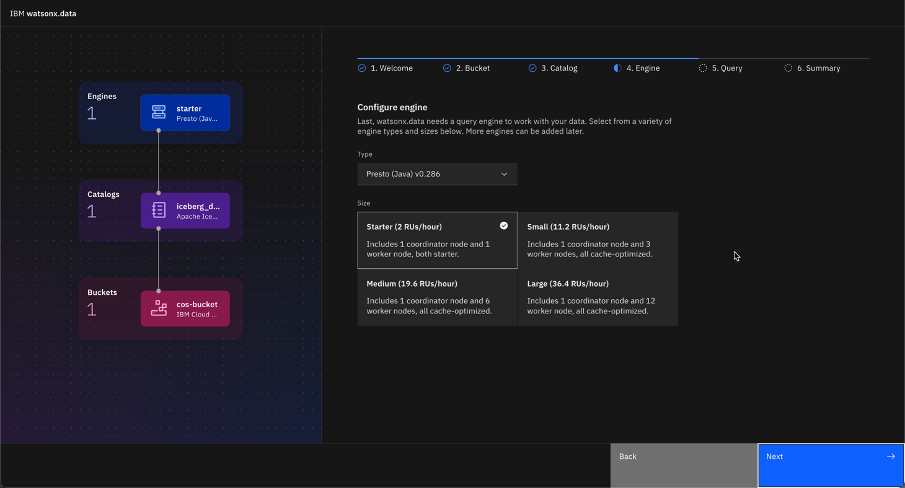
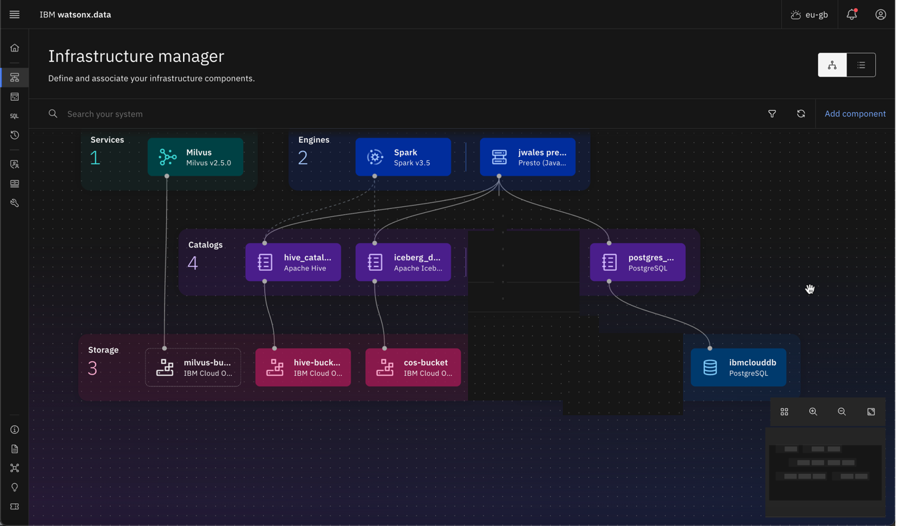
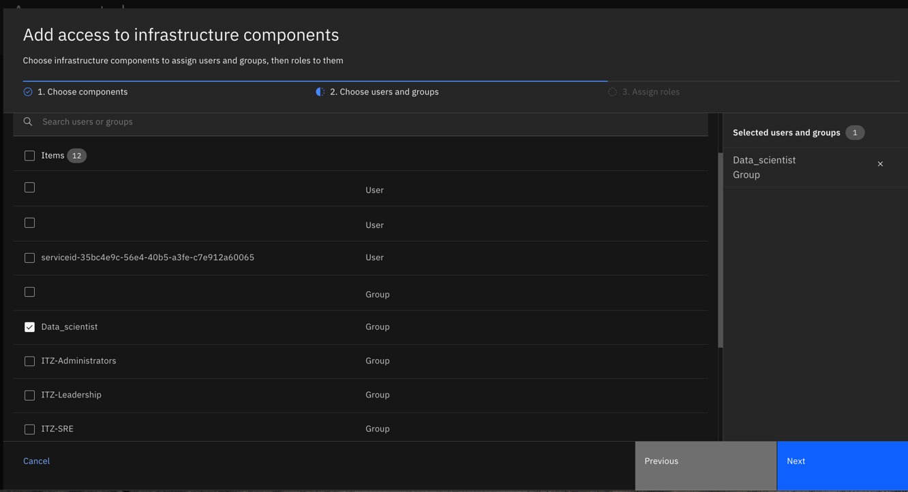
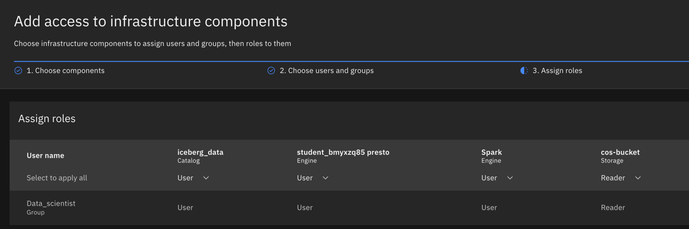

#  IBM watsonx.data Env. Setup (half-automated)

**Technical Hands-on Lab: Provision Environment**

- [IBM watsonx.data Env. Setup (half-automated)](#ibm-watsonxdata-env-setup-half-automated)
- [1. Getting Started](#1-getting-started)
  - [1.1 Open bootcamp main directory in VSCode or clone the repo if not yet](#11-open-bootcamp-main-directory-in-vscode-or-clone-the-repo-if-not-yet)
  - [1.2 Make sure you have correct remote repo](#12-make-sure-you-have-correct-remote-repo)
  - [1.3 Pull the latest changes](#13-pull-the-latest-changes)
  - [1.4 Login to your new Techzone environment](#14-login-to-your-new-techzone-environment)
  - [1.5 Verify you are in the right instance.](#15-verify-you-are-in-the-right-instance)
- [2. watsonx.data Instance initial setup (12-15 mins)](#2-watsonxdata-instance-initial-setup-12-15-mins)
- [3. Credentials and configurations](#3-credentials-and-configurations)
  - [3.1 Create an API key](#31-create-an-api-key)
  - [3.2 Create COS Service Credentials](#32-create-cos-service-credentials)
  - [3.3 Add watsonx.data configuraion to env file](#33-add-watsonxdata-configuraion-to-env-file)
  - [3.4 Copy Postgres credentials](#34-copy-postgres-credentials)
- [4 Run Auto setup script in Jupyter Notebook](#4-run-auto-setup-script-in-jupyter-notebook)
  - [4.1 Create virtual environment and install requirements](#41-create-virtual-environment-and-install-requirements)
  - [4.2 Run Jupyter Notebook with the script](#42-run-jupyter-notebook-with-the-script)
- [5 Verify](#5-verify)
- [6 Add Restricted User to x.data](#6-add-restricted-user-to-xdata)
  - [6.1. Add access to the infrastructure components](#61-add-access-to-the-infrastructure-components)


# 1. Getting Started

## 1.1 Open bootcamp main directory in VSCode or clone the repo if not yet
* VSCode -> Open Folder -> select `watsonx.data-client-bootcamp-2025 `
  
* Or if you need to clone the github repo
```sh
git clone git@github.ibm.com:skol/watsonx.data-client-bootcamp-2025 .git
```
## 1.2 Make sure you have correct remote repo

```sh
git remote -v 
```


## 1.3 Pull the latest changes

```sh
git pull
```

## 1.4 Login to your new Techzone environment 
:warning: As a prerequisite you should have a new instance of watsonx.data provisioned

* Go to: <https://cloud.ibm.com/resources>

* Login with your IBM credentials

You can reserve a new Techzone environment here [collection link](https://techzone.ibm.com/collection/67d1edfa2aa18c25d43edb04).


## 1.5 Verify you are in the right instance. 

Check at the top right that you are in the right instance –
**watsonx-events** or **watsonx-events2**


If it does not show the right name of the instance, you can select it from the drop-down.

<font color="red">**CAUTION:**</font>  The instance at the top right tends to change to your default personal account every time you switch/go back to a new page. Thus, it's always good to check the top right corner **every time** you switch to a new page.
  

# 2. watsonx.data Instance initial setup (12-15 mins)

* From your IBM Cloud page Hamburger menu, go back to `Resource list`
* Expand `Databases` and click on your watsonx.data instance, then select `Open web console`
* At `Welcome` screen, click `Next`


* Under configure `Bucket`

  * Select `Discover COS instance` and click `Next`


* Under Configure `Catalog`, 
  Select Apache Iceberg and click Next


* Under Configure `Engine`

  * Select Type: Presto Java, Size: Starter, Next



* Keep default for `Query` Monitoring and select Next

* Review `Summary` and Select Finish and go


:hourglass: **Wait while instance is provisioned – 12-20 minutes... do not close your browser**

After quick initial setup you should have the following components available in Infrustructure manager


# 3. Credentials and configurations

* Within `moderator-prep/scripts/auto-setup` folder create a subfolder `credentials` with 2 empty json files: `cos.json` and `postgres.json`. At later steps you will store there credentails for Cloud Object Storage `cos.json` and for Postgres database `postgres.json`.


* Create env file in `moderator-prep/scripts/auto-setup` folder: copy `moderator-prep/scripts/auto-setup/env_setup.example` as `moderator-prep/scripts/auto-setup/.env_setup` where you will during the next steps fill values for:
  * `CLOUD_API_KEY`
  * `WXD_REGION`
  * `WXD_INSTANCE_CRN`  


## 3.1 Create an API key

From the IBM Cloud interface use to the top menu

* Manage -> Access IAM 
* From the Left Navigation click Manage Identities -> API Keys
* Click on the Create button
* Copy the key to `moderator-prep/scripts/auto-setup/.env_setup` as a value for `CLOUD_API_KEY`

:warning: In case you create or re-create intial bucket manually for some reason, make sure to create **a regional bucket in the same location as watsonx.data** -> because location for COS instance is generated based on your region input for env file.

## 3.2 Create COS Service Credentials

From you storage interface, go to your COS Instance, and go to the `Service Credentials` tab.


* Select `+ New Credential`

* Name: `cos_credentials`

* Role: `Manager`

* Enable option for `HMAC Credentials`


* Select the twistie to show your credentials

* Copy and paste the credentials  in `moderator-prep/scripts/auto-setup/credentials/cos.json`


## 3.3 Add watsonx.data configuraion to env file

Go to IBM Cloud `Resource List`, click on watsonx.data instance in the databases, scroll down and copy values in `moderator-prep/scripts/auto-setup/.env_setup`:
* `CRN` as `WXD_INSTANCE_CRN`
* `Region` as `WXD_REGION`


## 3.4 Copy Postgres credentials

**If you are using Postgres provisioned to you by us**:  
From [Boxfolder](https://ibm.ent.box.com/folder/322609163013) `postgres.json` file copy all content into `moderator-prep/scripts/auto-setup/postgres.json`.

**If you provisioned Postgres yourself**:  
You should have `postgres.json` available locally after running `moderator-prep/instructions/Postgres-provisioning.md`; now copy all content into `moderator-prep/scripts/auto-setup/postgres.json`.

Now you should have `moderator-prep/scripts/auto-setup/.env_setup` and `moderator-prep/scripts/auto-setup/credentials` ready to run [Auto-setup.ipynb](../scripts/auto-setup/Auto-setup.ipynb) script.

# 4 Run Auto setup script in Jupyter Notebook

## 4.1 Create virtual environment and install requirements
* Open new terminal in VSCode  


* Make sure you have opened root directory in VSCode terminal

* Create a python environment

```sh
python3 -m venv venv_prep
```

* Activate a python environment

```sh
# On Windows
venv_prep\Scripts\activate
```

```sh
# On macOS/Linux
source venv_prep/bin/activate
```

* Install requirements for the current lab into python environment

```sh
pip install -r moderator-prep/scripts/auto-setup/requirements_autosetup.txt
```

## 4.2 Run Jupyter Notebook with the script
*  Open `moderator-prep/scripts/auto-setup/Auto-setup.ipynb`
*  Select kernel as `venv_prep`
*  Run All
*  As an output you should also get an output with some configuration prefilled for  your `.env_all` file -> `moderator-prep/scripts/auto-setup/.env_output`


# 5 Verify 

When finished with defining your required infrastructure components, you
should have something that looks like this:



# 6 Add Restricted User to x.data

## 6.1. Add access to the infrastructure components

In watsonx.data. go to Access Control, Add access

- Select all, Next

Under: Add access to infrastructure components, Select Data\_scientist
and click Next



- Select User for all engines

- Select Reader for any / all Storage buckets

Example:



- Add Policy to grant access to iceberg table

- Switch to Policies tab, click Add Policy

  - Policy name: iceberg

  - Change policy status after creation to Active, Click Next

  - Under Data objects, Choose a resource to get started, Select
iceberg\_data

  - Under search schemas, select all, Click Next


- Select Add rule +

- Rule type will be allow

- Under Actions, Select all

- On the right side of the screen, under Authorized users and groups,
click Add +

- Select Add users to rule

- Select data\_scientist group

- Click Add

- Click Add

- Click Review

- Click Create