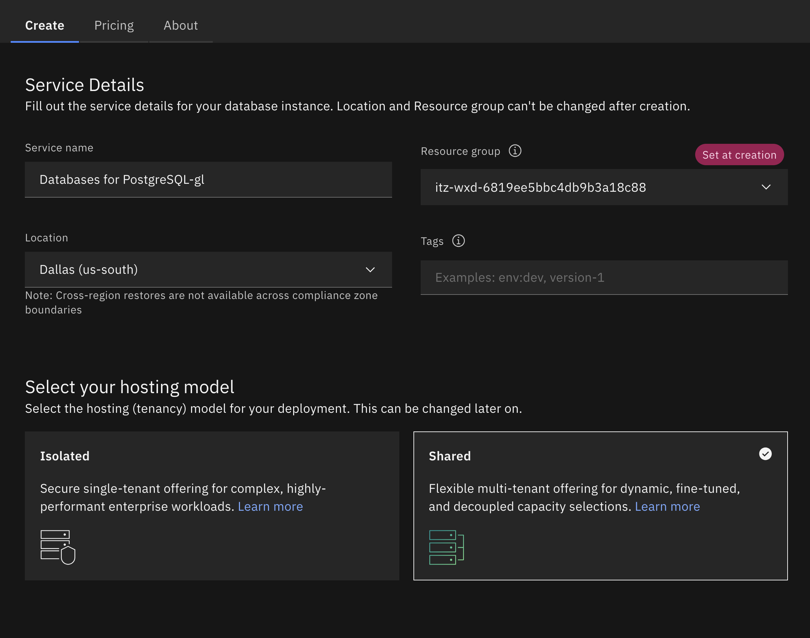
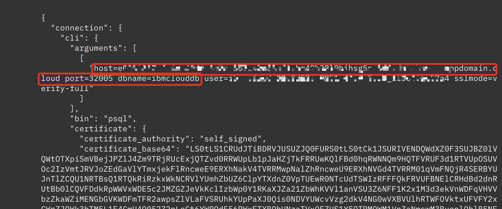

## Provision PostgreSQL
Shared Postgres database instance needs to be created within one of IBM Cloud accounts and filled with data using `./scripts/data-prep/add_data_postgres.ipynb` Jupyter Notebook. The script utilizes credentials from `./scripts/data-prep/.env_load`, example of env file is `env_load.example`.  
**Detailed steps:**  
### 1. Create Postgres Instance  
- From Resource List -> +Create resource -> Search for Databases for PostgreSQL;  
- For labs select shared environment

- The smallest custom configuration

- Enable public endpoint (for dummy data - labs only)

- Click create and wait for provisioning to finish

### 2. Environment file

- Copy the template in the root folder with the name .env_all

```sh
cp "moderator-prep/scripts/data-prep/env_load.example" "moderator-prep/scripts/data-prep/.env_load"
```

### 3. Credentials


- After successfully provisioning Postgres Database you will see it available in Resource list -> Databases 
- You will need to click on your instance and create new credentials

- :exclamation: Copy postgres credentials to a file named `postgres.json` locally -> you will use at later steps;

- Update `.env_load` with the values for your Postgres db name, user, password, host and port from the postgres credentials file.
  - From generated credentials you will need to copy the values below, they will be used in `.env_load`
  
  - dbname as db_name
  - host as dh_host
  - port as db_port
  
  - username as db_user
  - password as db_password
  - csv_file_path should point to the relative location of `gen_data/customers.csv`.

### 4. Create and activate a virtual environment
```sh
# create virtual environment
python3 -m venv venv
```
```
# On Windows
venv\Scripts\activate
```
```
# On macOS/Linux
source venv/bin/activate
```

### 5. Install requirements 
Install requirements for the add_data_postgres Notebook into python environment

```sh
pip install -r "moderator-prep/scripts/data-prep/requirements_data_prep.txt"
```

### 6. Add data to Postgres 

- Open [add_data_postgres.ipynb Jupyter Notebook](../scripts/data-prep/add_data_postgres.ipynb) by clicking the link or by navigating to the notebook
- Change the Kernel to venv python before running the notebook
- Run all 