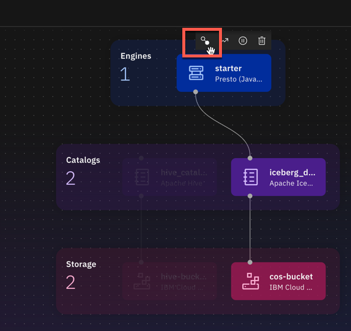
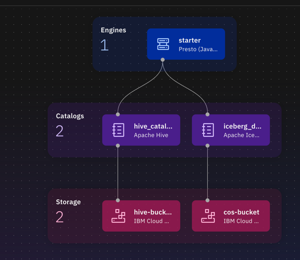
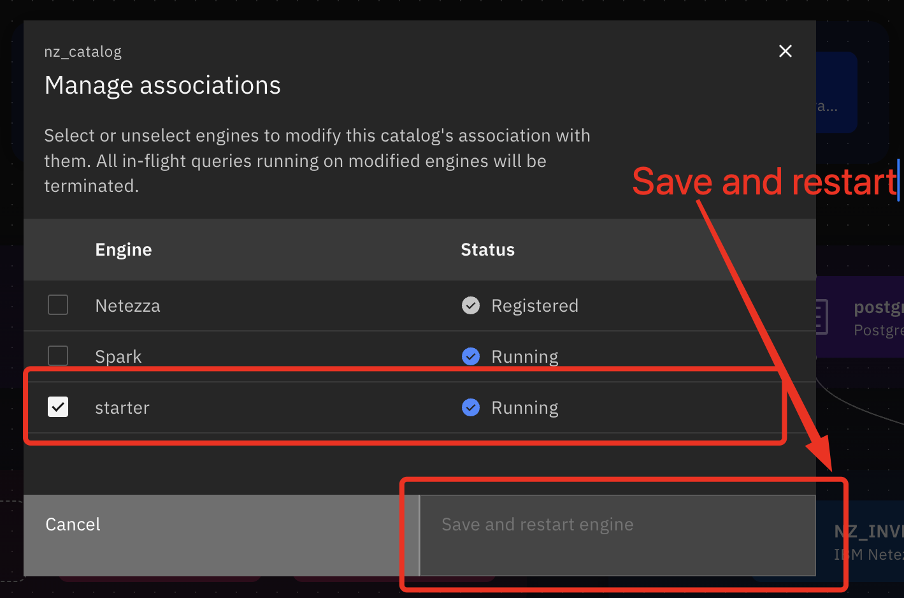

#  Configure watsonx.data bootcamp Environment (Manual Process)


**Table of contents**
- [Configure watsonx.data bootcamp Environment (Manual Process)](#configure-watsonxdata-bootcamp-environment-manual-process)
- [1. Getting Started](#1-getting-started)
  - [1.1 Clone the classroom Repo](#11-clone-the-classroom-repo)
  - [1.2 Provision the techzone environment](#12-provision-the-techzone-environment)
  - [1.3 Open your Techzone Reservation](#13-open-your-techzone-reservation)
  - [1.4 Login to your Techzone environment](#14-login-to-your-techzone-environment)
  - [1.5 Verify you are in the right instance.](#15-verify-you-are-in-the-right-instance)
  - [1.6 Open a Text Editor of your choice](#16-open-a-text-editor-of-your-choice)
  - [1.7 Create a Cloud API key](#17-create-a-cloud-api-key)
- [2. Setup the Cloud Object Storage Buckets for watsonx.data](#2-setup-the-cloud-object-storage-buckets-for-watsonxdata)
  - [2.1 Create Wxd bucket](#21-create-wxd-bucket)
  - [2.2 Create Hive bucket](#22-create-hive-bucket)
  - [2.3 Create Milvus bucket](#23-create-milvus-bucket)
  - [2.4 Create Input-data bucket](#24-create-input-data-bucket)
  - [2.5 Create COS Service Credentials](#25-create-cos-service-credentials)
  - [2.6 Find your Endpoint](#26-find-your-endpoint)
- [3. watsonx.data Instance initial setup (12-15 mins)](#3-watsonxdata-instance-initial-setup-12-15-mins)
  - [3.1 Add Hive Bucket and Catalog](#31-add-hive-bucket-and-catalog)
  - [3.2 Associate Hive Catalog with Presto Engine](#32-associate-hive-catalog-with-presto-engine)
  - [3.3 Add Postgres Data Source and Catalog](#33-add-postgres-data-source-and-catalog)
  - [3.4 Add Netezza Data Source Connection](#34-add-netezza-data-source-connection)
  - [3.5 Add Spark Engine](#35-add-spark-engine)
  - [3.6 Cloud Object Storage for Milvus](#36-cloud-object-storage-for-milvus)
  - [3.7 Add Milvus Service](#37-add-milvus-service)
- [4. Verify](#4-verify)
- [5 Add Restricted User to x.data](#5-add-restricted-user-to-xdata)
  - [5.1. Add access to the infrastructure components](#51-add-access-to-the-infrastructure-components)
- [6 Return to instructions](#6-return-to-instructions)


# 1. Getting Started

## 1.1 Clone the classroom Repo

Clone the classroom Repo via SSH
```sh
git clone git@github.ibm.com:jennifer-wales/watsonx.data-client-bootcamp-2025.git
```

If you are not setup for SSH, you can download via Browser instead:

* Go to: [moderator add http link to classroom repo]

* Click on Code, Download Zip  


## 1.2 Provision the techzone environment

For completing this bootcamp you will need the following services.
* watsonx.data
* Cloud Object Storage (COS)
* IBM watsonx.data intelligence
* watsonx.ai Studio & Runtime
* watsonx Orchestrate

Provision the watsonx.data TechZone [bundle](https://techzone.ibm.com/my/reservations/create/67e6c2a9bc768d343f1c08ea), which has all the components needed for the hands-on labs

## 1.3 Open your Techzone Reservation

* Go to your techzone reservation list:
<https://techzone.ibm.com/my/reservations>

* Look for your recently created reservation and click "Open this
environment".

* Scroll down and look for the name of the Cloud Account (should be
watsonx-events or watsonx-events2)


## 1.4 Login to your Techzone environment 

* Go to: <https://cloud.ibm.com/resources>

* Login with your IBM credentials

## 1.5 Verify you are in the right instance. 

Check at the top right that you are in the right instance –
**watsonx-events** or **watsonx-events2**


If it does not show the right name of the instance, you can select it from the drop-down.

<font color="red">**CAUTION:**</font>  The instance at the top right tends to change to your default personal account every time you switch/go back to a new page. Thus, it's always good to check the top right corner **every time** you switch to a new page.

## 1.6 Open a Text Editor of your choice

Open a text-based notepad to use as a ready reference for the lab.  The labs will have call outs to copy information that will be needed for future configuration steps.

Examples: Notepad on Windows, TextEdit on Mac or use `.txt` file in VSCode.  

## 1.7 Create a Cloud API key

From the IBM Cloud interface use to the top menu
![Manage Access]../attachments/2025-04-23-11-24-04-pasted-vscode.png)
* Manage -> Access IAM 
* From the Left Navigation click Manage Identities -> API Keys
* Click on the Create button
* Name you key **CLOUD_API_KEY** and click Create with the defaults
* Save **CLOUD_API_KEY** to your text Reference
* Download the file to your laptop / desktop.


# 2. Setup the Cloud Object Storage Buckets for watsonx.data

The purpose of creating the COS buckets is to the source data sets used in the lab in their respective COS buckets.

* From the IBM Cloud page, Click on Hamburger menu, Go to Resource List, and select Storage
![Storage instance]../attachments/2025-04-23-11-26-03-pasted-vscode.png)
* Open Cloud Object Storage Instance (in a new tab)  
:warning:  *Make sure that all buckets have the same location*

The following 4 buckets are needed for the lab:

1. **Wxd bucket**: For watsonx.data (iceberg catalog)
2. **Hive bucket**: For Hive catalog
3. **Milvus bucket**: For Milvus service
4. **Input-data bucket**: For Input data

## 2.1 Create Wxd bucket

* Click on the 'Create Bucket +' button.
* Click 'create' at the bottom of the "Create a Custom Bucket" tile.
* Add “**wxd-**“ prefix to the autogenerated bucket name.
* Take default for rest of the settings.
* Change location to correspond to location of your watsonx.data
* Select Create bucket
* Save Wxd `bucket name` to your text Reference (you will use in a future step)
![]../attachments/2025-04-23-11-31-01-pasted-vscode.png)

## 2.2 Create Hive bucket

* Go back to your COS Instance and Create another bucket for Hive (you will use this for ingesting data)

* Click on the 'Create Bucket +' button.
* Click 'create' at the bottom of the  "Create a Custom Bucket" tile.
* Add “**hive-**“ prefix to the autogenerated bucket name.
* Change location to correspond to location of your watsonx.data
* Take default for rest of the settings.
* Select Create bucket
* Save Hive `bucket name` to your text Reference (you will use in a future step)

## 2.3 Create Milvus bucket

* Go back to your COS Instance and Create another bucket for Milvus (you will use this for storing the vector data)

* Select + to Create Bucket, Select Create a custom bucket, Create
* Add “**milvus-**“ prefix tothe autogenerated bucket name.
* Change location to correspond to location of your watsonx.data
* Take default for rest of the settings.
* Select Create bucket
* Save Milvus `bucket name` to your text Reference (you will use in a future step)

## 2.4 Create Input-data bucket

* Go back to your COS Instance and Create another bucket for Input-data

* Select + to Create Bucket, Select Create a custom bucket, Create
* Add “**input-data-“** prefix to the autogenerated bucket name.
* Change location to correspond to location of your watsonx.data
* Take default for rest of the settings.
* Select Create bucket
* Save Input-data bucket `bucket name` to your text Reference (you will use in a future step)

Once you perform steps 2.2.1 to 2.2.4 you should have screen similar to the one below.
![COS buckets]../attachments/2025-04-23-11-36-58-pasted-vscode.png)

## 2.5 Create COS Service Credentials

From you storage interface, go to your COS Instance, and go to the `Service Credentials` tab.


* Select `+ New Credential`

* Name: `cos_credentials`

* Role: `Manager`

* Enable option for `HMAC Credentials`


* Select the twistie to show your credentials

* Copy and paste the credentials json to your text Reference (you will use
in a future step)


## 2.6 Find your Endpoint

* Go to `Buckets` Tab in your COS instance, Select Bucketname, Click on `Configuration`, jump to `Endpoints`
* Since all your buckets are created under the same `Location` they will have the same `Endpoints`


* Copy the **Public** endpoint where your techzone instance was
provisioned pre-pended with https:// into your text Reference  (you will use in a future step).

* For example – Dallas is
`s3.us-south.cloud-object-storage.appdomain.cloud`  
Save in your reference as: `https://s3.us-south.cloud-object-storage.appdomain.cloud`


# 3. watsonx.data Instance initial setup (12-15 mins)

* From your IBM Cloud page Hamburger menu, go back to `Resource list`
* Expand `Databases` and click on your watsonx.data instance, then select `Open web console`
* At `Welcome` screen, select next


* Under configure `Bucket` / `Storage`

  * Register my own

  * Fill in the required information about the wxd COS bucket from your text
  Reference

    * `Region`: select region where your bucket was created

    * `Bucket name`: wxd-{your bucketname}

    * `Display name`: wxd-cos-bucket

    * `Endpoint`: prepend public endpoint with https://{COS Endpoint}

    example: https://
    s3.direct.us-south.cloud-object-storage.appdomain.cloud

    * `Access key` – use access\_key\_id from cos\_hmac keys

    * For `Secret key` – use secret\_access\_key from cos\_hmac\_keys

  * Test connection – if successful, click Next  
  :warning: *Make sure you have no leading or trailing spaces when copying values*


* Under Configure `Catalog`, 
  Select Apache Iceberg and click Next


* Under Configure `Engine`

  * Select Type: Presto Java, Size: `Small`, Next


* Keep default for `Query` Monitoring and select Next

* Review `Summary` and Select Finish and go


:hourglass: **Wait while instance is provisioned – 12-20 minutes... do not close your browser**


## 3.1 Add Hive Bucket and Catalog

* Go to `Infrastructure Manager`

* `Add Component`, Under Storage, select `IBM Cloud Object Storage`, select Next

* Fill out Storage Configuration with hive bucket settings from your notes


* `Test connection`. When successful, select options to Associate Catalog
and Activate now

* Under Assocate Catalog, select `Apache Hive` catalog and name catalog
`hive_catalog` and click Associate


## 3.2 Associate Hive Catalog with Presto Engine

* Click option to `Manage associations`



* Enable hive\_catalog option and select Save and restart engine


When finished – you should see presto associated with both iceberg and
hive catalogs:



## 3.3 Add Postgres Data Source and Catalog

 * `Infrastructure Manager`, `Add component`, Under Data Sources, select `PostgreSQL`, Next

* Test connection

* When successful, select option to `Associate catalog`

* Under Associate Catalog name catalog `postgres_catalog` and click `Create`


* Associate with Presto Engine by hovering over `postgres_catalog` and clicking `Manage associations`

* Associate with presto Engine, `Save and restart engine`


## 3.4 Add Netezza Data Source Connection

1. In your `watsonx.data` Instance
2. Under Infrastructure Manager, select `Add component`
3. Under Data Sources, select `IBM Netezza` and `Next` (make sure you are not adding an Engine) 

1. Fill out as follows:
   * Name = NZ_INVESTMENTS
   * Data Source Name = INVESTMENTS
   * Instructor to provide:  `Hostname`, `Port`, `Username` and `Password`
   * Test Connection
   * Select option to `Associate Catalog` 
   * Catalog name = `nz_catalog`
   * Select `Create`


2. From Infrastructure manager associate `nz_catalog` with the Presto engine by hovering over catalog and clicking on `Manage associations`<br>
    <br>
    <br>

3. Check in `Data manager` that data from Netezza has been synchronized via `nz_catalog`

    


## 3.5 Add Spark Engine

* `Infrastructure Manager`, `Add component`

* Under Engines, select `IBM Spark`, next

* Display name: Spark

* `Create a native Spark engine`

* Change Default Spark version to 3.5:exclamation:*(put in your notes spark version to later create cluster in VSCode with the same version of spark)*

* Engine home bucket – keep default of `cos-bucket`

* Node type: Small

* Num of Nodes 1

* Under Associate catalogs (select all: `hive_catalog` and `iceberg_data`)

* Create

**Start Spark History Server**

* In Infrastructure Manager, Click on Spark Engine

* Go to Spark history tab

* Click Start history server

* Take defaults for Cores / memory and click Start.

## 3.6 Cloud Object Storage for Milvus

* `Infrastructure Manager`, `Add Component`, Under Storage, select `IBM Cloud Object Storage`, select
Next

* Fill out Storage Configuration with milvus bucket settings

* Do not associate catalogs -> Milvus doesn't require

* Test connection. When successful, click `Associate`

## 3.7 Add Milvus Service

* `Infrastructure Manager`, `Add component`

* Under Services, select `Milvus`, Next

* For display name enter `milvus`

* Size: Starter

* Under add storage bucket, pick Milvus bucket

* For path enter `/`

* Select `Create`

# 4. Verify

When finished with defining your required infrastructure components, you
should have something that looks like this:


# 5 Add Restricted User to x.data

## 5.1. Add access to the infrastructure components

In watsonx.data. go to Access Control, Add access

- Select all, Next

Under: Add access to infrastructure components, Select Data\_scientist
and click Next


- Select User for all engines

- Select Reader for any / all Storage buckets

Example:


- Add Policy to grant access to iceberg table

- Switch to Policies tab, click Add Policy

  - Policy name: iceberg

  - Change policy status after creation to Active, Click Next

  - Under Data objects, Choose a resource to get started, Select
iceberg\_data

  - Under search schemas, select all, Click Next


- Select Add rule +

- Rule type will be allow

- Under Actions, Select all

- On the right side of the screen, under Authorized users and groups,
click Add +

- Select Add users to rule

- Select data\_scientist group

- Click Add

- Click Add

- Click Review

- Click Create


# 6 Return to instructions

Go back to [techzone-env-setup.md](../techzone-env-setup.md).