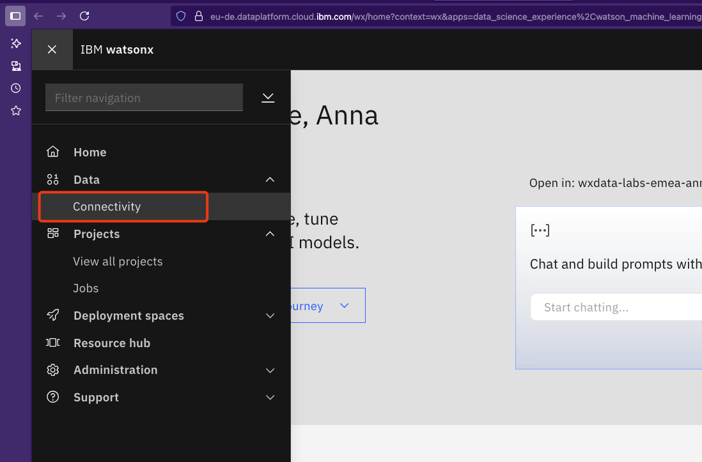
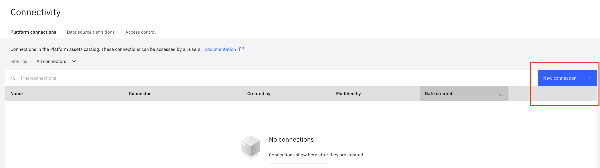
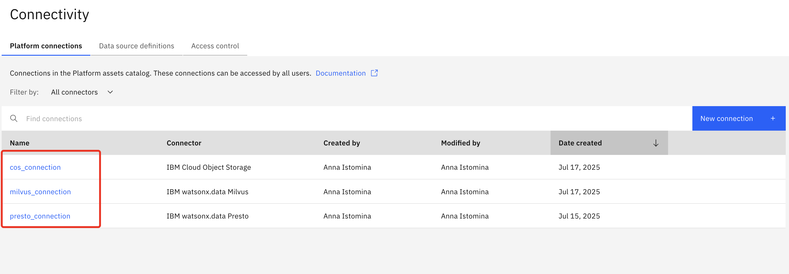

# Content to share with students and wx.ai setup 

## 1. Text file with credentials and configurations

Prepare text file that contains content below needed by students to perform the labs.

```
## ------content they will use in their env file ----------
# Spark Engine ID  -> Update with Engine ID provided by instructor
SPARK_ENGINE_ID=""

# COS buckets -> Update with COS bucket names provided by instructor
HIVE_BUCKET=""
WXD_BUCKET=""
MILVUS_BUCKET=""
INPUT_BUCKET=""

# watsonx data catalogs -> Should not need to change unless provided by instructor
HIVE_CATALOG="hive_catalog"
ICEBERG_CATALOG="iceberg_data"
```

If you use auto-setup, then you can copy `SPARK_ENGINE_ID` and bucket names from the generated `moderator-prep/scripts/auto-setup/.env_output`.

In case of manual setup, use bucket names from your reference file, and `SPARK_ENGINE_ID` is available in watsonx.data UI -> `Infrastructure Manager` -> click on spark engine -> Details -> `Engine Id`.

## 2.  watsonx.ai Connections
You will create cross-platform watsonx.ai connections to be used in labs by participants. You will share those connections with all participants so they are able to add them to Watson Studio Projects.

Go to watsonx.ai: from IBM Cloud Resource List -> select `watsonx.ai Runtime` service -> `Launch` in watsonx

From `Humburger menu` select `Data` -> `Connectivity`


There stay on tab `Platform connections` -> `New Connection +`


### 2.1 Add Presto Connection
Search for `IBM watsonx.data` -> Select `Presto`


**Fill in your connection details**:  
The easiest way will be to fill in connection details from JSON snippet from `watsonx.data`:
* From IBM Cloud Resource List -> in Databases select watsonx.data instance -> Open web console
* Go to `Configurations` -> `Connection information` -> `IBM Products` -> Select presto engine in `Engine and service connection details` -> Click on `Copy JSON snippet`


When copied (✅  with Copied appeared), paste JSON snippet into watsonx.ai, press `Enter`:

You should see all connection details entered except for API key, enter it manually:  
* Rename the name of the connection to (required): `presto_connection`
* API key (required): `your CLOUD_API_KEY`  
Now you can `Test connection` (upper right corner), once successful, `Create` connection.


### 2.2 Add milvus connection

New connection -> Search for `IBM watsonx.data` -> Select `Milvus`


**Fill in your connection details**:  
The easiest way will be to fill in connection details from JSON snippet from watsonx.data:
* From IBM Cloud Resource List -> in Databases select watsonx.data instance -> Open web console 
* Go to `Configurations` -> `Connection information` -> `IBM Products` -> Select Milvus in `Engine and service connection details` -> Click on `Copy JSON snippet`


A window will pop out, there select `default` database and `Copy to clipboard`

When copied (✅  with Copied appeared), paste JSON snippet into watsonx.ai, press `Enter`:

You should see all connection details entered except for Username and Password
* Rename the name of the connection to (required): `milvus_connection`
* Username (required): `ibmlhapikey`
* Password (required): `your CLOUD_API_KEY`  
Now you can `Test connection` (upper right corner), once successful, `Create` connection.


### 2.3 Add COS connection
New connection -> Search for `IBM Cloud Object Storage` -> Select `IBM Cloud Object Storage`

Fill in your connection details:
* Enter connection name

* Leave `Bucket` name field empty


* fill in `Login URL` with COS Bucket Public Endpoint without `https://`

You can find COS Public Endpoint from IBM Cloud [Resource list](https://cloud.ibm.com/resources)-> Select and click on `cos instance` -> `Buckets` tab -> Select one of the buckets created, e.g. `hive` bucket -> Go to `Configurations`


Copy public endpoint


* For credentials select `Resource instance ID and API key`

* To get `Resource instance ID` and `API key` you need to go back to COS service instance -> click back to instance from the bucket 


And copy values to watsonx.ai Connection:
* `Resource instance ID`: `resource_instance_id`
* `API key`: `apikey`

Now test connection and if successful, click `Create`.


### 2.4 Check connections
Check connections names and connectors in `Platform connections`, if differ, click on individual connections and edit according to the instructions above.


## 3 Return to the instructions

Go back to [techzone-env-setup.md](../techzone-env-setup.md).