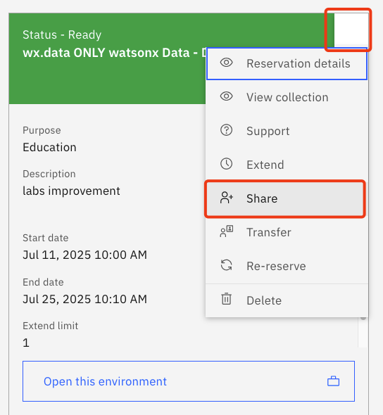
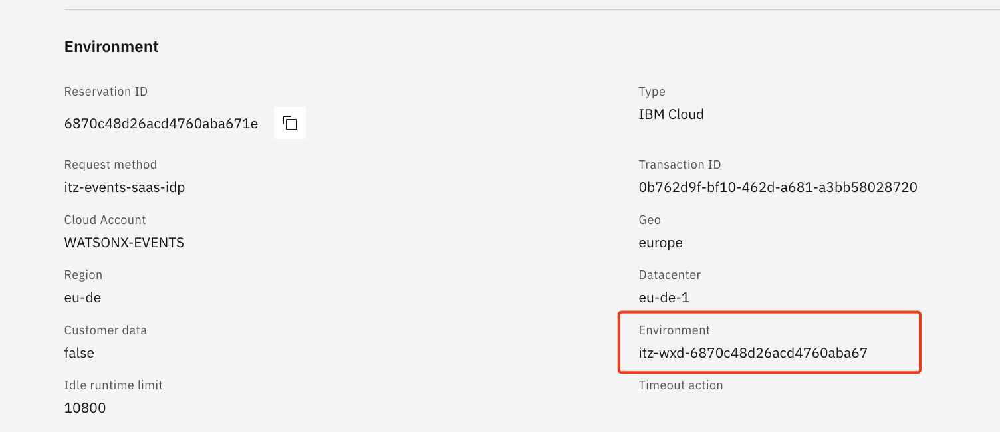
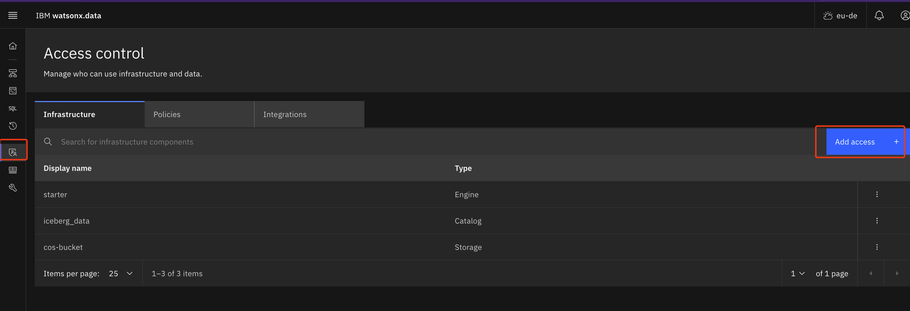
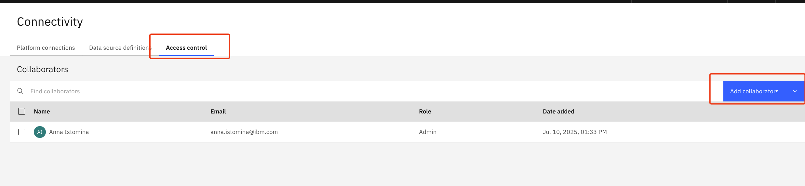
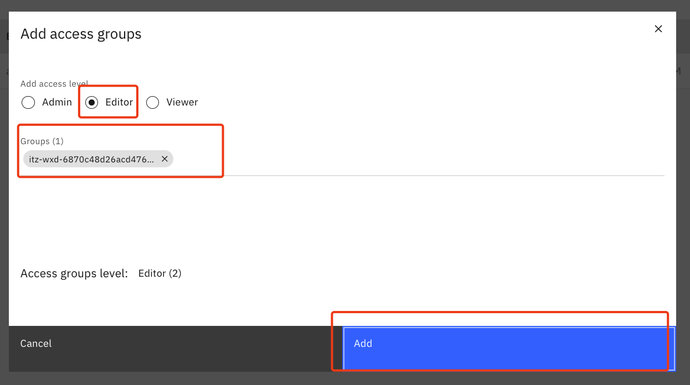

# Bootcamp Techzone Environment

- [Bootcamp Techzone Environment](#bootcamp-techzone-environment)
  - [1. Prerequisities](#1-prerequisities)
    - [1.1 Environment](#11-environment)
    - [1.2 Data Sources](#12-data-sources)
      - [1.2.1 Netezza](#121-netezza)
      - [1.2.2 Postgres SQL](#122-postgres-sql)
  - [2. Setup Overview](#2-setup-overview)
    - [2.1 Provision and setup watsonx.data bootcamp Environment](#21-provision-and-setup-watsonxdata-bootcamp-environment)
    - [2.2 Prepare handover configurations and setup watsonx.ai connections](#22-prepare-handover-configurations-and-setup-watsonxai-connections)
    - [2.3 Share the Techzone environment](#23-share-the-techzone-environment)
    - [2.4 Share access to watsonx.data](#24-share-access-to-watsonxdata)
    - [2.5 Share connections in watsonx.ai](#25-share-connections-in-watsonxai)

The bootcamp will use a shared Techzone environment for all students, to be created by the instructor.

## 1. Prerequisities
### 1.1 Environment
TechZone [bundle](https://techzone.ibm.com/my/reservations/create/67e6c2a9bc768d343f1c08ea), which has all the components needed for the hands-on labs, including:

   * watsonx.data
   * Cloud Object Storage (COS)
   * watsonx.data Intelligence (Formerly IKC)
   * watsonx.ai Studio & Runtime
   * watsonx Orchestrate

At this step you need to request a new environment in Techzone (Demo with corresponding opportunity ID), at later steps you will do pre-setup and share reservation/ services with bootcamp participants.

### 1.2 Data Sources
During labs you will work both with structured and unstructured (text data).  
🗃️ Structured data include:
- historic equity transactions for 2019 - 2025 (stored in `Netezza`);
- customer data incl. their personal information and some bank scoring data (will be stored in `Postgres`);
- dumps from other systems in `json/parquet` format that include tax percentage per trading country, accounts/ clients information, and historic data for holdings of different assets for up to 2023.

:exclamation: All of the structured and semi-structured data for this lab were generated and do not correspond to any real equity transactions or bank clients.

📁 Files required for labs execution could be found in `./data` folder:
   - `./data/customers.csv` is a text file with customers data information that will be in later steps uploaded into Postgres.
   - `./data/input_data_hive` - parquet files with the information on accounts, historical holdings and tax liability that will be used in Lab2, they will be linked to hive catalog -> as part of moderator prep you will this directory it at a later step in COS bucket;
      - `tax_liability.json` was created by LLM based on the list of countries and random persentage numbers -> do not correspond to the reality, serve only for educational purposes.
  - `./data/pdfs` contain pdfs with equity market information for Agentic Rag, first you will ingest them from COS bucket during Lab4 -> as part of moderator prep you will upload those files at a later step in COS bucket.

🗄️ Data stores to make available for labs:
   #### 1.2.1 Netezza  
To showcase DWH offload capability you will need Netezza connection with `INVESTMENTS` database that was created and filled with data. Currently we use NPS instance from @Daniel Hancock. There we have a user `STUDENT_01` generated with access limited to `INVESTMENTS` database (SELECT and LIST access for `equity_transactions` and `equity_transactions_ly` schemas).

**Netezza credentials are in the boxnote [here](https://ibm.ent.box.com/notes/1873722995947).**  
Data description in Netezza can be found [here](../Labs/Lab1_Data_Warehouse_Optimization/Data-description.md).
   #### 1.2.2 Postgres SQL  
Postgres SQL customer table will be used to demonstrate federation capabilities of watsonx.data Presto and will be added as a data source.  

-  Currently we have a Postgres SQL instance available in the `watsonx-events` account.  

-  :warning: If the `Postgres xdata bootcamp` service is not available once you provision your bundle, you will need to manually create the service and populate it with data.  

Postgres xdata bootcamp credentials [here](https://ibm.ent.box.com/notes/1873722995947) 
Steps to provision Postgres and populate with data [here](./instructions/Postgres-provisioning.md)

## 2. Setup Overview
The instructor will pre-setup the techzone environment and then share with the bootcamp participants.  All students will use the same account and service instances.

### 2.1 Provision and setup watsonx.data bootcamp Environment
You will pre-setup environment that you will later share with the bootcamp participants: you will be using the same account and services' instances.

**1. Provision and setup watsonx.data bootcamp Environment**

There are 2 options:
   - [Half-automatic setup](./instructions/Autosetup-watsonx-environment.md): some parts of the provisioning are automated incl. COS buckets, watsonx.data engines and services using watsonx.data API and COS API, as those APIs change you might need to adjust python script. 
   - [Manual setup](./instructions/UI-watsonx-environment-setup.md): all of the setup is done in UI.

**2. Upload data (binary files and pdfs)**  

Folder `moderator-prep/data` contains directories with files that are required for the second lab (`files` or `input_data_hive`) and for Lab4 - Rag Agent (`pdfs`).

Upload them to the corresponding COS buckets following [instructions](./instructions/Add-cos-files.md).  
:warning: Make sure files are available at local directory [moderator-prep/data](./data).

### 2.2 Prepare handover configurations and setup watsonx.ai connections

Follow instructions [here](./instructions/wx-ai-env-prep.md)

### 2.3 Share the Techzone environment
   - Invite students to Techzone Env
      - Go to your IBM Techzone, `My reservations` https://techzone.ibm.com/my/reservations
      - Find the reservation you created for the Lab -> `More options` -> `Share`
      
      - There enter emails of users that you will share environment with. 
   Users will receive either an email with invitation to IBM Cloud Account or see a new notification in IBM Cloud. Once they accept this invitation they will be added to the account and a resource group with services in this environment.

   Note:  If users do not receive an invitation, you can manually invite them via IBM Cloud by following instructions in [1.2 Students did not receive techzone invitation ](../Troubleshooting/README.md)
   
### 2.4 Share access to watsonx.data 
   -  Find your resource group so you can share acess to it
     - In your Techzone reservations click on the right Techzone reservation and copy `Environment`, that is your resource group -> the same one your should see in IBM Cloud Resource List / Groups
  
   - Share access in watsonx.data
     - Go to watsonx.data instance -> Access Control -> Add access
  
     - There select all component of watsonx.data with Items box
     - Click Next
     - There search for a resource group corresponding to your account and select it -> Next
     - Choose `Admin` roles for all components, remember to scroll left to select all engines/sources/services
     - Save
### 2.5 Share connections in watsonx.ai
 - Go to watsonx.ai -> In Hamburger menu select `Data/ Connectivity`
 - Go to `Access control` tab -> Add collaborators -> Add user group
  
     - There select search for your resource group
     - Select Editor access and click Add
  

